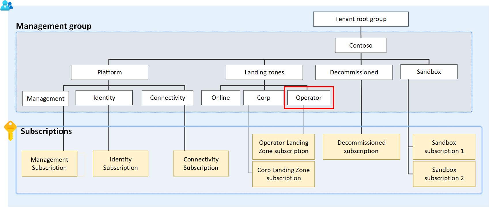

# Governance for Telco Industry Scenarios

In general, any application composition can be deployed, managed and governed in Azure using the existing prescriptive and architecture guidance provided in Cloud Adoption Framework. However, some applications typical for the Telco industry, such as those that provide managed services to end customers (B2C), or businesses (B2B) require additional sets of controls and governance that are different from the traditional LoB applications and cloud native applications. 

Telco industry specific applications typically provide services such as Core CP, SBC, vIMS, vHSS, Thin/uCPE, SDWAN, vFW, vRouter, vLTM, CGNAT, vBNG, DDI and vRADIUS/DIAMETER among others.

For example, B2B and B2C telco applications may require deploying their own ExpressRoute Gateways so they can use dedicated ExpressRoute circuits to the access network for data plane traffic, while other dedicated circuits can provide connectivity to on-premises network for control plane traffic. Another example would be applications that require public IPs in their Landing Zones, or the need to have IP forwarding capabilities on VM NICs.

## Management Group

Given these specialized requirements and to cater for scalability for Telco industry specific scenarios in landing zones, the Azure for Telco industry reference architecture recommends the creation a new Management Group dedicated to Telco industry specific applications and services. 

Azure policies that are designed to govern and manage those applications can be assigned to ensure Telco applications are compliant, and configured with high-availability as default at this scope. Subscriptions dedicated for such applications would need to be deployed under this new management group, which is depicted in figure 1 below:

_Figure 1: Management group for business to business and business to customer applications._

## Azure Policies

The following table summarizes the Azure Policies that are recommended to be assigned at the Management Group dedicated for Telco industry scenarios:

| Policy                                      | Description                                                                                         | Version |
|---------------------------------------------|-----------------------------------------------------------------------------------------------------|---------|
| Ensure Zone Redundant Gateways are deployed | Ensures that ExpressRoute gateways for Telco specialized workloads are deployed as highly-available | 1.0.0   |
| Ensure Public IPs are Zone Redundant        | Ensures that Public Ip addresses for Telco specialized workloads are deployed as highly-available   | 1.0.0   |