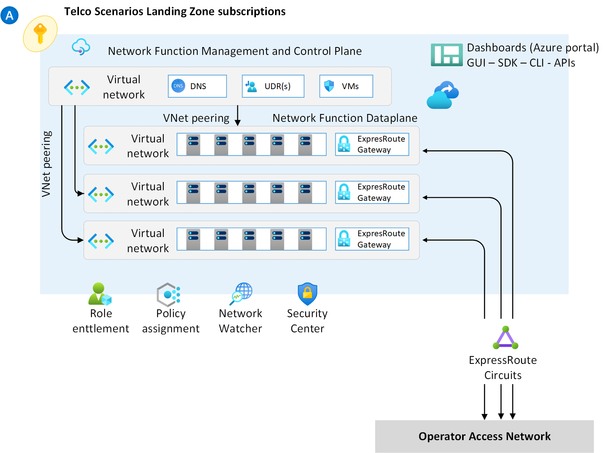

# Networking for Telco Industry Scenarios

The Azure for Telco industry reference architecture provides the foundational networking and connectivity services for deploying telco applications and services in Microsoft Azure at scale.

The Network topology and connectivity design considerations and recommendations described in the [Cloud Adoption Framework](https://docs.microsoft.com/azure/cloud-adoption-framework/ready/enterprise-scale/architecture) are mostly compatible with the Azure for Telco reference architecture. For example, guidance around access to Azure PaaS services via Private Link, or the usage of hub and spoke or VWAN network topologies are fully compatible with the Azure for Telco reference architecture.

Our guidance diverges from the Cloud Adoption Framework when it comes to addressing the Telco specific requirements, as outlined in the introduction above. Most of these changes focus on how to provide more scalable, flexible connectivity using a modified network topology and ExpressRoute connectivity.

This added complexity is due to most companies in the Telco industry having multiple interconnected on-premises or other private networks (such as an MPLS) they depend on to provide B2B and B2C services for their customers. Many Telco customers also have an heavily segmented on-premises network that is highly isolated across multiple Virtual Routing and Forwarding (VRFs).

## Design Considerations

- Customers in the Telco industry have an on-premises network where both, internal IT systems as well as telco-specific workloads (such as SBC) are deployed in infrastructure such as bare metal, hardware virtualization (such as VMware or Hyper-V) or private clouds (such as OpenStack or Azure Stack).

- On-premises networks for telco customers have a high level of isolation across multiple VRFs for scenarios such as overlapping IP address space, workload isolation, avoid network contention across services among others. Typical VRFs seen in the Telco industry include:
  - Access
  - Core
  - Operations and Management
  - Media
  - Signaling
  - Internet
  - Others

- Many telco workloads in on-premises network require communication across two or more of such VRFs, and would require similar isolation when such applications are deployed in Azure.

- Azure provides a flat layer-3 network, and hence does not offer a native solution to extend VRFs into virtual networks. However, it is possible to use any of the following approaches by using native Azure technologies:
  - Map a VRF to an ExpressRoute circuit.
  - Map VRFs by using multiple IPSec tunnels

- As an alternative, customers can use a network overlay (such as VXLAN) over ExpressRoute Private Peering to map on-premises VRF isolation to the Azure VNet.

- Work in progress

## Design Recommendations

- As first approach, evaluate whether is possible to consolidate multiple VRFs over a single (or a small set of) ExpressRoute circuit(s). In this way, a network topology based on hub and spoke architecture or Azure Virtual WAN as recommended in Cloud Adoption Framework would be sufficient without the added complexity.

- If is not possible to consolidate multiple VRFs into a single (or a small set of) ExpressRoute circuit(s), evaluate which of the following alternatives would be suitable for your environment to map multiple VRFs to Azure:

### Multiple ExpressRoute Circuits

#### Design Considerations

- Consider the following ExpressRoute limits when designing for a solution involving multiple ExpressRoute circuits:
  - Up to 4 ExpressRoute connections into the same ExpressRoute Gateway when then connections are provisioned from the same peering location.
  - For Azure VWAN, up to 8 ExpressRoute connections into the same VHub when then connections are provisioned from different peering locations.
  - For hub and spoke, up to 16 ExpressRoute connections into the same VHub when then connections are provisioned from different peering locations.

- Azure Virtual WAN allows the creation of multiple VHubs in the same region within the same VWAN resource. 

- In hub and spoke networks, it is possible to deploy multi-homed virtual networks (virtual networks connected to two or more hub virtual networks) by using UDRs and a NVA (such as Azure Firewall) or by using the Azure Route Server.

#### Design Recommendations
- Use dedicated ExpressRoute circuits and dedicated ExpressRoute Gateways when end-to-end network isolation from an on-premises VRF into Azure VNet is required.
- Connect virtual networks by using VNet peering when resources across different virtual networks need to communicate with each other.
  - A typical scenario is a management plane VNet communicating with data plane VNet(s) as depicted in the picture below:

### IPSec Tunnels

### Overlay Network Technologies (such as VXLAN)

