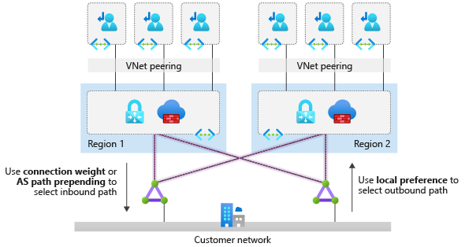
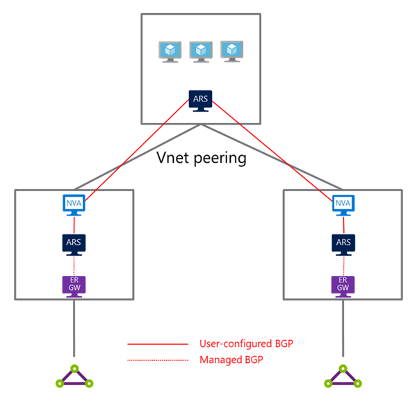
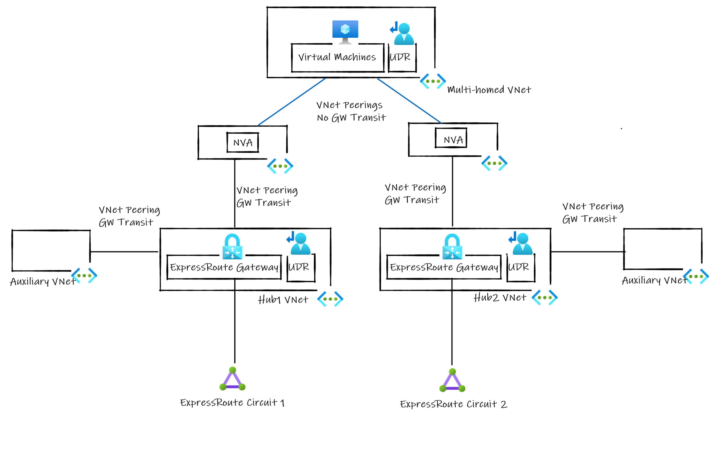
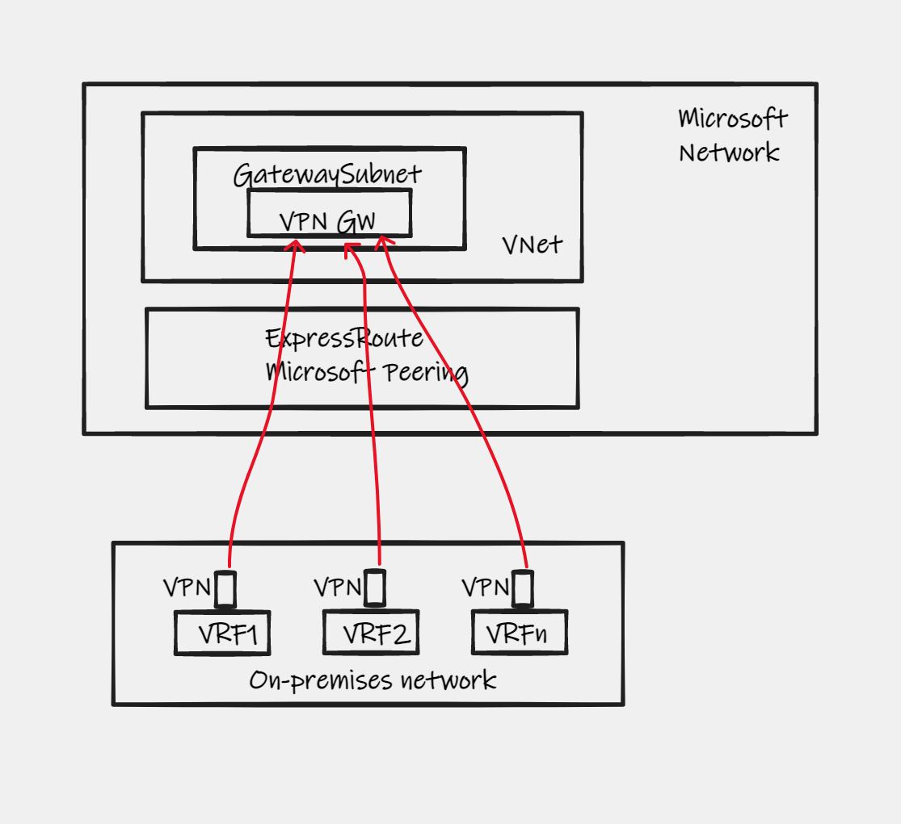
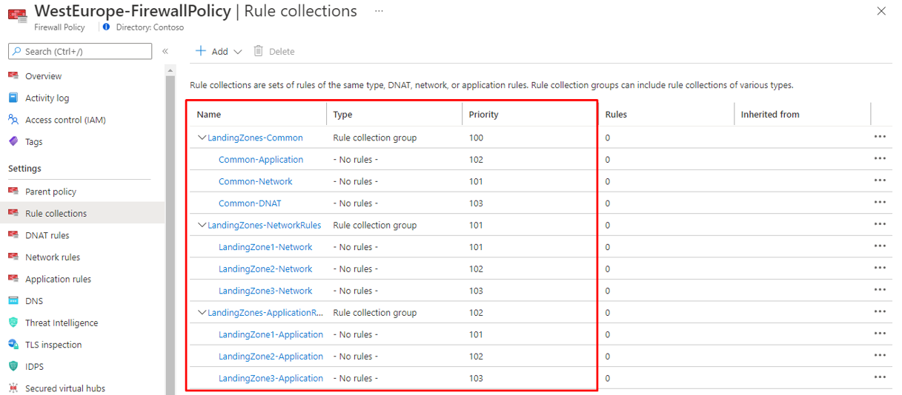
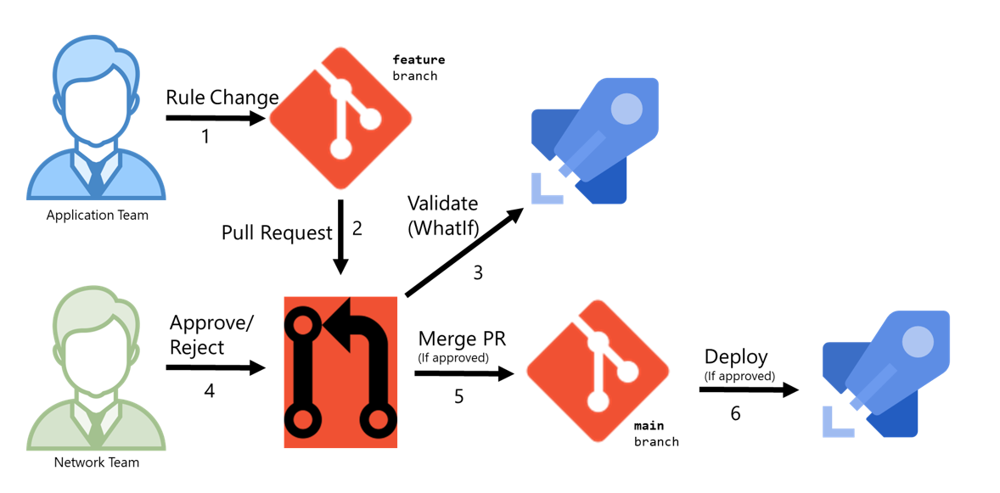

# Networking for Telco Industry Scenarios

The Azure for Operators (AfO) Landing Zones architecture provides the foundational networking and connectivity services for deploying telco applications and services on Microsoft Azure at scale.

The [Network topology and connectivity](https://docs.microsoft.com/azure/cloud-adoption-framework/ready/landing-zone/design-area/network-topology-and-connectivity) design considerations and recommendations described in the [Cloud Adoption Framework](https://docs.microsoft.com/azure/cloud-adoption-framework/ready/enterprise-scale/architecture) are mostly compatible with the AfO Landing Zones architecture. For example, guidance around access to Azure PaaS services via Private Link, or the usage of hub and spoke or VWAN network topologies are fully compatible with the AfO Landing Zones architecture.

Our guidance diverges from the Cloud Adoption Framework when it comes to addressing the telco specific requirements. Most of these changes focus on how to provide more scalable and flexible connectivity using a modified network topology with multiple ExpressRoute circuits.

AfO Landing Zones considers a network architecture where multiple ExpressRoute circuits may be needed. This is because many companies in the telco industry have multiple on-premises networks or other private networks (such as an MPLS) they depend on to provide specialized telco services to their customers (for example, a managed SD-WAN solution or a managed SBC). It is not uncommon for customers in the telco industry to have a heavily segmented on-premises network that is highly isolated across multiple Virtual Routing and Forwarding (VRFs).

> Many customers in the Telco industry have on-premises networks that have a high level of isolation across multiple VRFs for scenarios such as overlapping IP address space, workload isolation, avoiding network contention across services among others.

The following sections will cover networking design considerations and recommendations for such scenarios.

- [Azure Regions](#azure-regions)
- [Multiple ExpressRoute Circuits](#multiple-expressroute-circuits)
- [Multiple IPSec Tunnels](#multiple-ipsec-tunnels)
- [Azure Virtual Network Manager](#azure-virtual-network-manager)
- [Manage Azure Firewall rules at scale](#manage-azure-firewall-rules-at-scale)

## Azure Regions

### Design Considerations

- Azure availability zones are physically separate locations within each Azure region that are tolerant to local failures (such as floods or fire).
- Azure regions are designed to offer protection against localized disasters with availability zones and protection from regional or large geography disasters with disaster recovery, by making use of another region.
- Each Azure region is paired with another region within the same geography.
  - This approach allows for the replication of resources across a geography that should reduce the likelihood of natural disasters, civil unrest, power outages, or physical network outages affecting both regions at once.
- Additional advantages of region pairs include:
  - In the event of a wider Azure outage, one region is prioritized out of every pair to help reduce the time to restore for applications.
  - Planned Azure updates are rolled out to paired regions one at a time to minimize downtime and risk of application outage.
  - Data continues to reside within the same geography as its pair (except for Brazil South) for tax and law enforcement jurisdiction purposes.
- Azure latency across Azure regions is constantly monitored and round-trip latency statics are published on this [article](https://docs.microsoft.com/azure/networking/azure-network-latency)

### Design Recommendations

- For maximum resiliency, deploy an Azure networking platform in at least two Azure regions (preferrably region pairs). This will protect your infrastructure in Azure against localized disasters with availability zones and also from regional or large geography disasters, by making use of another region.
- Deploy a hub VNet (for hub and spoke networks) or a virtual hub (for Virtual WAN based network topologies) on each of the Azure regions choosen in your organization.
  - Note that AfO Landing Zones architecture considers that an operator network can have more than one hub or vHub on the same Azure region.
- Besides protecting you from a disaster in an Azure region, this architecture allows you to deploy highly available, mission critical systems in an Active-Passive or Active-Active configuration where instances of your application can be deployed across 2 (or more) Azure regions.
- Each ExpressRoute Gateway should be connected to at least two ExpressRoute circuits per routing domain (in case the operator is using multiple ExpressRoute circuits to isolate routing domains). The ExpressRoute circuits should be provisioned from different [peering locations](https://docs.microsoft.com/azure/expressroute/expressroute-locations-providers#expressroute-locations). This will remove any single-point-of-failures for connecting on-premises network to Azure.
  - Use BGP techniques such as AS path prepending and local preference to ensure [optimal routing across the ExpressRoute circuits](https://docs.microsoft.com/azure/expressroute/expressroute-optimize-routing).
  - This setup is depicted in picture 1 below:

_Figure 1: Dual regions with cross connected ExpressRoute circuits._

## Multiple ExpressRoute Circuits

### Design Considerations

- It is not uncommon for customers in the telco industry to have a heavily segmented on-premises network that is highly isolated across multiple Virtual Routing and Forwarding (VRFs). Such on-premises networks have a high level of isolation across multiple VRFs for scenarios such as overlapping IP address space, workload isolation, avoid network contention across services among others. Typical VRFs seen in the Telco industry include:
  - Access
  - Core
  - Operations and Management
  - Media
  - Signaling
  - Internet

- Many telco workloads in on-premises networks require to be able to communication across two or more VRFs, and would require a similar isolation when such applications are migrated to or deployed as net-new applications on Azure.
- Azure provides a flat layer-3 network, and hence does not offer a native solution to extend VRFs into virtual networks. However, it is possible to maintain network isolation from on-premises to Azure by:
- Use an ExpressRoute circuit per VRF.
- Use an IPSec tunnel per VRF.
- As an alternative, customers can use a network overlay (such as VXLAN) over ExpressRoute Private Peering to maintain network isolation from on-premises to Azure.
- Consider the following ExpressRoute limits when designing for a solution involving multiple ExpressRoute circuits:
  - Up to 4 ExpressRoute connections into the same ExpressRoute Gateway when then connections are provisioned from the same peering location.
  - For Azure VWAN, up to 8 ExpressRoute connections into the same VHub when then connections are provisioned from different peering locations.
  - For hub and spoke, up to 16 ExpressRoute connections into the same VHub when then connections are provisioned from different peering locations.
- Azure Virtual WAN allows the creation of multiple VHubs in the same region within the same VWAN resource. As Azure VWAN VHubs are fully meshed, VMs in Azure VWAN can communicate to on-premises networks through any of their VHUBs.
- In hub andd spoke networks, spoke VNets are typically connected to one hub VNet, but it is possible to connect a spoke VNet to two or more hub VNets via VNet peering. This network topology is called **multi-homed network**, and in this configuration, virtual machines in the spoke VNet can communicate through either hub virtual network to the on-premises network(s).

### Design Recommendations

Evaluate whether is possible to consolidate multiple VRFs over a single (or a small set of) ExpressRoute circuit(s). In this way, a network topology based on a hub and spoke architecture or Azure Virtual WAN as recommended in the [Define an Azure network topology](https://docs.microsoft.com/azure/cloud-adoption-framework/ready/azure-best-practices/define-an-azure-network-topology) article in the Cloud Adoption Framework would be sufficient without the added complexity of multiple ExpressRoute circuits. If is not possible to consolidate multiple VRFs into a single (or a small set of) ExpressRoute circuit(s), evaluate which of the following alternatives would be suitable for your environment to connect multiple on-premises VRFs to Azure:

- Use dedicated ExpressRoute circuits and dedicated ExpressRoute Gateways when end-to-end network isolation from an on-premises VRFs to Azure is required.
  - This approach not only ensures end-to-end network isolation from on-premises to Azure, but also, it overcomes the ExpressRoute connections limits described in the design considerations section above.
- In Azure, connect virtual networks by using VNet peering when resources across different virtual networks need to communicate with each other.
- When using dedicated ExpressRoute circuits and VNets, and Azure resources must be accesible over two on more ExpressRoute circuits, a multi-homed VNets network architecture is required. A multi-homed VNet architecture can be implemented by using one of the following approaches:
  - **Dynamic routing with Azure Route Server (Preferred)**. In this setup, a Network Virtual Appliance (NVA) in the hub virtual network will learn about on-premises routes from the ExpressRoute gateway through route exchange with the Route Server in the hub. In return, the NVA will send the spoke virtual network addresses to the ExpressRoute gateway using the same Route Server. The Route Server in both the spoke and hub virtual network will then program the on-premises network addresses to the virtual machines in their respective virtual network. The virtual machines in the spoke virtual network will send all traffic destined for the on-premises network to the NVA in the hub virtual network first. Then the NVA will forward the traffic to the on-premises network through ExpressRoute. Traffic from on-premises will traverse the same data path in the reverse direction. In this setup, neither of the Route Servers are in the data path. This scenario is depicted in figure 2 below:

  

  _Figure 2: Multi-homed VNets using Azure Route Server_
  - **Static routing with User Defined Routes (UDRs)**. As a spoke VNet can only be connected to one hub VNet by using the “use remote gateway” VNet peering property, we need a different mechanism to ensure a VNet connected to two or more hubs can be reachable from on-premises and vice versa via the different ExpressRoute circuits. If Azure Route Server cannot be used, an alternative approach is by implementing a network model that uses an “auxiliary” or “routing” VNet, with the sole purpose of ensuring that the ExpressRoute gateway advertises to on-premises the address space of the spoke VNets that are connected to the hub without the “use remote gateway” VNet peering property. In this scenario a UDR in the Gateway subnet is required to ensure traffic arriving at the ExpressRoute Gateway with destination a spoke VNet is routed via the Firewall. A UDR in the spoke VNet(s) is also required to send traffic to on-premises over a specific firewall, depending on which VRF or ExpressRoute circuit the traffic needs to go through. This network model with the “routing” or “auxiliary” VNet is depicted in figure 3 below.

  
  _Figure 3: Multi-homed VNets using User Defined Routes_

## Multiple IPSec Tunnels

### Design Considerations

- Azure provides a cloud-native VPN Gateway as a PaaS service. It is a fully-managed service by Microsoft which allows you to connect on-premises and other networks to your Azure VNet via VPN/IPSec tunnels.
- Azure VPN Gateway supports regional, zonal and zone-redundant deployments.
- Azure site-to-site or VNet-to-VNet VPN Gateway [supports](https://docs.microsoft.com/azure/vpn-gateway/vpn-gateway-about-vpngateways#gwsku) up to 10 Gpbs aggregated throughput and a maximum of up to 100 tunnels.
  - There can be up to one VPN Gateway per VNet.
- Azure Virtual WAN site-to-site VPN Gateway [supports](https://docs.microsoft.com/azure/azure-resource-manager/management/azure-subscription-service-limits#virtual-wan-limits) up to 20 Gpbs aggregated throughput and a maximum of up to 1,000 connections per hub.
  - There can be up to one VPN Gateway per Virtual WAN virtual hub.
- Azure VPN Gateway in both, a virtual network and Virtual WAN, are accesible:
  - Over the internet connecting via their public IP addresses.
  - Over ExpressRoute Private Peering via their private IP addresses.
  - Over ExpressRoute Microsoft Peering via their public IP addresses being advertised over the ExpressRoute connection.

### Design Recommendations

Consider the following recommendations if you are deploying the Azure VPN Gateway or Azure Virtual WAN VPN Gateway in your environment:

- If you cannot consolidate multiple VRFs over a single (or a small set of) ExpressRoute circuit(s), you must maintain network isolation from multiple on-premises VRFs to Azure and you cannot use [multiple ExpressRoute circuits](#multiple-expressroute-circuits) as described in the previous section, evaluate a network architecture where you maintain the network isolation across multiple on-premises VRFs to Azure by using:
  - ExpressRoute with Microsoft Peering
  - Use a VPN tunnel (or multiple, for high availability) per on-premises VRF that requires network isolation connectivity to Azure.
  - Connect the site-to-site VPN tunnel from on-premises to Azure via ExpressRoute Microsoft peering.
  - This setup is depicted on figure 4 below:
  
  _Figure 4: Network isolation over multiple VPN tunnels_
- For maximum resiliency, deploy the Azure VPN Gateway as zone-redundant in the regions that support Availability Zones.
  - If the region does not support Availability Zones, deploy the VPN Gateway as regional.
- Deploy the VPN Gateway as zonal only if you are aligning your resources to a specific zone for scenarios such as minimize latency.
- Choose carefully the right Azure VPN Gateway [SKU](https://docs.microsoft.com/azure/vpn-gateway/vpn-gateway-about-vpngateways#gwsku) or Azure Virtual WAN VPN Gateway scale units, as that will determine the capabilities and overall throughput of the gateway.
- If you need up to 100 site-to-site VPN tunnels use either Azure VPN Gateway or Azure Virtual WAN VPN Gateway.
  - Use Azure Virtual WAN if you need more than 100 site-to-site VPN tunnels.

## Azure Virtual Network Manager
- **_Work in progress_**

## Manage Azure Firewall rules at scale

For customers that have selected Azure Firewall as the service to govern outbound traffic to the internet, east-west traffic between landing zones (spokes) as well as non-http/s inbound connections, there are several design considerations in terms of how to structure the rule groups/rules, especially as the number of landing zones (spokes) grow.

This article describes considerations and recommendations on how rules and rule collection groups can be managed with the least management overhead within the platform/service limits.

### Design Considerations

- Consider the  [Azure Firewall service limits](https://docs.microsoft.com/en-us/azure/azure-resource-manager/management/azure-subscription-service-limits#azure-firewall-limits) for rules and rule collection groups.
  - Note that there is a difference in limits for rule collection groups created before/after July 2022.
- Review the [rule processing logic](https://docs.microsoft.com/en-us/azure/firewall/rule-processing#rule-processing-using-firewall-policy) to ensure that rule sets implemented will have the desired effect.

### Design Recommendations

- Create a global Azure Firewall policy to govern security posture across the global network environment. Assign the policy to all Azure Firewall instances.
  - If needed, create additional, more granular policies to meet specific regional requirements and delegate access to local teams using role-based access control

- To avoid unnecessary management overhead, avoid creating rule collections with explicit 'Deny' actions. Since Azure Firewall denies all traffic by default until rules are manually configured to allow traffic, explicit 'Deny' should only be used by exception.

- Due to the firewall scaling limits, do not create one rule collection group per landing zone/spoke.

    Instead, create a base structure of rule collection groups in the global Azure Firewall Policy covering the required network flows. Consider the following key rule collection groups when creating your base structure. Additional rule collections can always be created based on requirements.

  - **Landing Zones - Common rules**
    This rule collection group will consist of application, network and DNAT rule collections, enabling all common flows for landing zones/spokes, such as access to common security, monitoring, and other backend services.

  - **Landing Zones - Network Rules**
    In this rule collection group, we create one [network rule collection](https://docs.microsoft.com/en-us/azure/firewall/policy-rule-sets#network-rules) per landing zone to manage all network (L3/L4) flows to/from the landing zone.

  - **Landing Zones - Application Rules**
    In this rule collection group, we create one [application rule collection](https://docs.microsoft.com/en-us/azure/firewall/policy-rule-sets#application-rules) per landing zone to manage all supported application (L7) flows to/from the landing zone.

  
  _Figure 5: example of base rule collection group structure from the Azure Portal_

- Integrate existing landing zone lifecycle management processes to ensure creation/deletion of the landing zone-specific rule collections as new landing zones are provisioned and decommissioned.

- Manage rule collection groups/rule collections as Infrastructure-as-Code (IaC) artifacts in a Git repository with branch protection policies as well CI/CD pipelines to do automatic testing and deployment after changes have been approved.

    Consider inviting application teams to the repository hosting the rules to enable them to manage the rules concerning their landing zones in a self-service manner while still maintaining control of deployments in the central networking team.

    
    _Figure 6: example of standard Git pull request workflow with approval_
