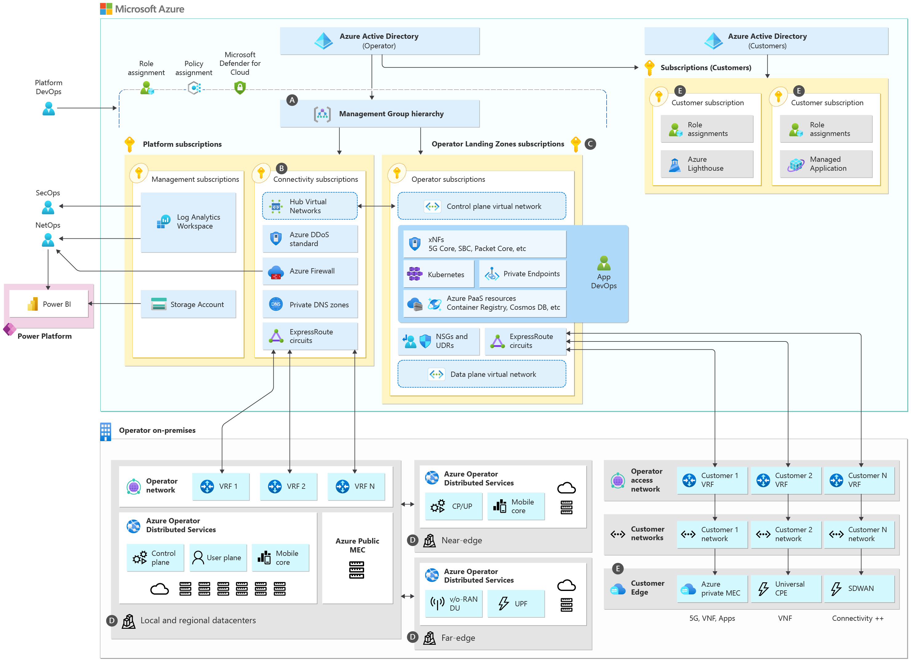

# Azure for Telecommunications

Due to the network centric nature of their business, organizations in the Telecommunications (or Telco) industry have a unique set of requirements compared to other organizations of similar scale. Such requirements include:

* Delivery of strenuous networking services that consume large amounts of bandwidth and are sensitive to latency and jitter on the network (ex. VOIP or video streaming).
* Provide networking and end user services to consumers (ex. firewall as a service, cloud storage, cloud email, etc).
* Provide managed services to other companies (ex. SD-WAN solutions, SoC or SBC).
* Leverage the provider’s distributed near and far edge to deliver services closer to where their end users are for better performance and lower latency (ex. 5G, gaming or augmented reality).

This article provides a reference architecture with prescriptive guidance and recommendations for the Telco industry across the Microsoft Cloud (Power Platform, Dynamics, Microsoft 365 and Microsoft Azure).

## Table of contents

* [Azure for Telecommunications Reference Implementation](#azure-for-telecommunications-reference-implementation)
* [Azure for Telecommunications Reference Architecture](#azure-for-telecommunications-reference-architecture)
* [Azure for Operators Landing Zones Reference Implementation](#azure-for-operators-landing-zones-reference-implementation)
* [Azure for Operators Landing Zones](#azure-for-operators-landing-zones)
* [High-level architecture](#high-level-architecture)
  * [Governance for Telco Industry Scenarios](#letter-a)
  * [Networking for Telco Industry Scenarios](#letter-b)
  * [Operator Landing Zones](#letter-c)
  * [Distributed Edge](#letter-d)
  * [Operator Services](#letter-e)
* [Next Steps](#next-steps)

## Azure for Operators Landing Zones Reference Implementation

| Reference Implementation | Description | Deploy | Documentation
|:----------------------|:------------|--------|--------------|
| AfO Landing Zones foundation | Azure for Operators (AfO) Landing Zones foundation that provides a full, rich, compliant architecture with scale-out pattern for connectivity and landing zones for operators | | [User Guide](./referenceImplementation/readme.md)
| AfO Landing Zones networking scale-out | When the AfO Landing Zones foundation is in place, you can use this reference implementation to scale-out the hub virtual network and configure the corresponding networking infrastructure | | [Scale-out Guide](./referenceImplementation/readme.md)

## Azure for Operators Landing Zones

This article describes the Azure for Operators (AfO) Landing Zones reference architecture which enables the delivery of telco specialized workloads on Microsoft Azure and at the edge.

### High-level architecture

The AfO Landing Zones architecture is based on a [proven, at scale Azure architecture](https://docs.microsoft.com/azure/cloud-adoption-framework/ready/enterprise-scale/architecture) foundation for the construction and operationalization of landing zones in Azure, which at its core is build upon a set of design principles and critical design areas (as summarized on this [article](../foundations/azure/README.md)). Those design principles and critical design areas are applicable for this AfO Landing Zones architecture. However, due to the unique set of requirements and characteristics of the telecommunications industry (for example, the presence or a large distributed edge), the AfO Landing Zones architecture provides an additional, and very specific, set of recommendations to accommodate telco industry requirements and scenarios as described previously on this article. The AfO Landing Zones architecture is depicted on figure 1 below:

_Figure 1:AfO Landing Zones architecture._

As figure 1 depicts, the AfO Landing Zones architecture follows the design principles and recommendations of proven, compliant, and scalable landing zones architecture on Azure, but it provides specific guidance and recommendations in the following areas to accommodate for the typical requirements of operators:

 [Governance for Telco Industry Scenarios](./docs/telco-governance.md). To cater for scalability for Telco industry specific scenarios in landing zones, the AfO Landing Zones architecture recommends the creation a new Management Group dedicated to Telco industry specific applications and services. Azure policies that are designed to govern and manage those applications can be assigned to ensure Telco applications are compliant, and configured with high-availability as default at this scope and subscriptions dedicated for such applications would need to be deployed under this management group.

 [Networking for Telco Industry Scenarios](./docs/telco-networking.md). While the networking design considerations and recommendations described in the [Cloud Adoption Framework](https://docs.microsoft.com/azure/cloud-adoption-framework/ready/enterprise-scale/architecture) are mostly compatible with the AfO Landing Zones architecture, our guidance diverges from the Cloud Adoption Framework when it comes to addressing the Telco specific requirements, as outlined in the introduction above. Most of these changes focus on how to provide more scalable, flexible connectivity for carrier-grade workloads by using a modified network topology by using multiple ExpressRoute circuits.

 [Operator Landing Zones](./docs/operator-landing-zones.md). This section focuses on providing guidance and reference architectures for deploying mission-critical, carieer-grade telco applications, such as 5G Core, packet core, session boarder control, etc, on especialized Operator Landing Zones.

 [Distributed Edge](./docs/telco-edge.md). The AfO Landing Zones architecture provides prescriptive guidance to leverage the operator's distributed edge infrastructure to provide network functions (such as mobile core or UPF) at the near and far edge via [Network Cloud](https://azure.microsoft.com/blog/improving-the-cloud-for-telcos-updates-of-microsoft-s-acquisition-of-att-s-network-cloud/).

 [Operator Services](./solutions/mgmtOptions/readme.md). In addition to providing networking services to their customers, operators also provide managed services and managed solutions to their customers either from the operators own Azure AD tenant, or directly in their customer's Azure AD tenants.

### Next Steps
The following articles will provide detailed design considerations and recommendations for AfO Landing Zones key design areas.

* [Governance for Telco Industry Scenarios](./docs/telco-governance.md)
* [Networking for Telco Industry Scenarios](./docs/telco-networking.md)
* [Operator Landing Zones](./docs/operator-landing-zones.md)
* [Distributed Edge](./docs/telco-edge.md)
* [Operator Services](./solutions/mgmtOptions/readme.md)

---

[Back to documentation root](../README.md)