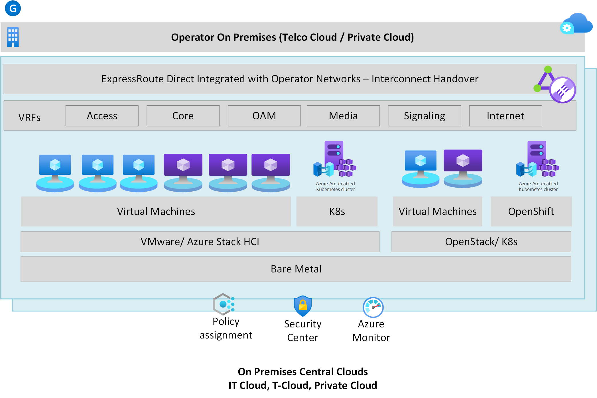
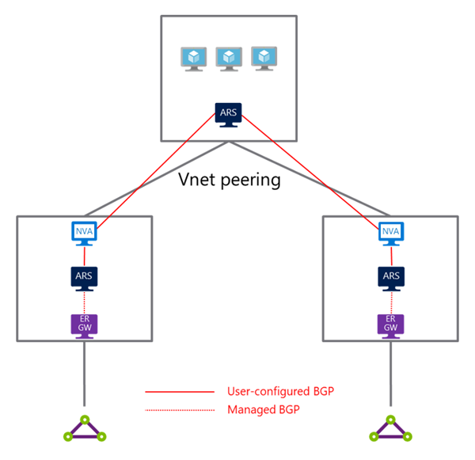

# Telecommunications Industry Reference Architecture

| Industry Architecture | Description | Deploy |
|:----------------------|:------------|--------|
| Microsoft Cloud for Telco Industry | Cloud Foundation that spans across Azure, Power Platform, and Microsoft 365 for Telco industry and workloads |

Customers in the Telecommunications (or Telco) industry have a unique set of requirements compared to enterprises or customers in other industries. Such requirements include:

* Delivery of networking services that consume large amounts of bandwidth and are sensitive to latency and jitter on the network (for example, video or streaming).
* Provide networking and end-user services to consumers (for example, firewall or storage capacity as added value services on top of an internet line at home).
* Provide managed services to other companies (for example, provide a managed SD-WAN solution).
* Leverage the provider’s distributed edges to provide services closer to where their end users are for better performance and lower latency (examples include 5G, gaming or augmented reality).

This article provides a reference architecture with prescriptive guidance and recommendations for the Telco industry across the Microsoft Cloud (Power Platform, Dynamics, Microsoft 365 and Microsoft Azure).

## Telco Industry Reference Architecture on Microsoft Azure

This article describes Telco industry reference architecture on Microsoft Azure to enable the delivery of Telco specialized workloads on Microsoft Azure and at the edge.

### High-level architecture

The Telco industry reference architecture on Microsoft Azure is based on an [Enterprise-Scale Landing Zone](https://docs.microsoft.com/en-us/azure/cloud-adoption-framework/ready/enterprise-scale/architecture) foundation for the construction and operationalization of landing zones on Azure, at scale, and then it provides a specific set of recommendations to accommodate for the Telco industry requirements and scenarios as described previously on this article. The reference architecture for Telco industry on Microsoft Azure is depicted on figure 1 below:

_Figure 1: Reference architecture for the telco industry on Microsoft Azure._

As figure 1 depicts, the reference architecture for the Telco industry on Microsoft Azure follows the design principles and recommendations of Enterprise-Scale Landing Zones, but it provides specific guidance and recommendations in the following areas to accommodate for the typical requirements of customers in the Telco industry:

* Telco workloads (depicted as C in figure 1).
* Networking (Depicted as E in figure 1).
* Telco distributed edge (Depicted as G in figure 1).

The following sections will provide a high-level overview of the considerations for each of those areas, and subsequent articles will provide detailed design considerations and recommendations.

### Telco workloads

Several applications, especially internal ones, from the application portfolio of customers in the Telco industry can be deployed, managed and governed in Azure as per existing prescriptive guidance in Enterprise-Scale Landing Zones. However, some applications, such as applications targeted to provide managed services to end customers (B2C), or businesses (B2B) might require a set of controls and governance that are different from the internal line-of-business (LOB) applications. These applications typically provide services such as Core CP, vIMS, vHSS, Thin/uCPE, SDWAN, vFW, vRouter, vLTM, CGNAT, vBNG, DDI and vRadius among others.

For example, such telco applications may require deploying their own ExpressRoute Gateways, use dedicated ExpressRoute circuits for data plane traffic, whilst still need connectivity to on-premises network for control plane traffic. Or such applications may need to use public IPs in their Landing Zones.

Given those specialized requirements, which might conflict with existing policy controls for internal LOB applications, the reference architecture for the Microsoft Cloud for Telco industry recommends to create a new Management Group dedicated for Telco applications. Then, Azure policies that are designed to govern and manage those applications can be assigned at this scope and subscriptions dedicated for such applications would need to be moved under this management group. This new management group is depicted in figure 2 below:

_Figure 2: Management group for business to business and business to customer applications._

### Networking

The reference architecture for the Microsoft Cloud for Telco industry is based on Enterprise-Scale Landing Zones to provide the foundational networking and connectivity services for deploying landing zones in Microsoft Azure at scale.

Network topology and connectivity design considerations and recommendations in Enterprise-Scale Landing Zones are compatible with the Microsoft Cloud for Telco industry reference architecture. For example, recommendations to access Azure PaaS services via Private Link or the usage of hub and spoke or VWAN network topologies are fully compatible with this reference architecture.

However, to accommodate for specific requirements of customers in the Telco industry, the Microsoft Cloud for Telco industry reference architecture provides additional networking recommendations, specifically in the ExpressRoute connectivity and network topology.

This is primarily as many customers in the Telco industry do not have a single interconnected on-premises network (such as an MPLS) as enterprise customers have. Many Telco customers have an on-premises network that is highly isolated across multiple Virtual Routing and Forwarding (VRFs). This network isolation across VRFs is depicted in figure 3 below with some common VRFs found across customers in the Telco industry (such as core network, signaling or media):

_Figure 3 – On-premises network with isolation across multiple example VRFs_

Thus, a network topology that can cater for keeping such network isolation from on-premises to Azure might be required (depending on actual customer needs). Some customers may be fine with consolidating multiple VRFs over a single (or a small set of ) ExpressRoute circuit(s). In this scenario, a network topology based on hub and spoke architecture or Azure Virtual WAN as recommended in Enterprise-Scale landing zones would be sufficient.

However, if the Telco customer cannot consolidate their VRFs and requires isolation between on-premises and Microsoft Azure, then this reference architecture provides design considerations and recommendations to ensure isolation is maintained either by using IPSec tunnels, or by using multiple ExpressRoute circuits and a network topology with multiple hub virtual networks and multi-homed spoke VNets as depicted in figure 4 below.

_Figure 4: Dual-homed virtual network with Azure Route Server and ExpressRoute_

---
***NOTE***

While figure 4 depicts a dual-homed network architecture with Azure Route Server and third party appliances, a similar network architecture can be implemented with Azure Firewall and User Defined Routes (UDR).

---

### Operator distributed edge

Telcos operate a distributed edge network to provide services (such as Radio Access Networks (RAN) or Wi-Fi) closer to where their customers are. The Microsoft Cloud for Telco industry reference implementation provides prescriptive guidance to leverage the Telco’s distributed edge infrastructure to provide Azure services at the edge via [Azure Stack Edge](https://docs.microsoft.com/en-us/azure/databox-online/) and [Azure private multi-access edge compute (MEC)](https://docs.microsoft.com/en-us/azure/private-multi-access-edge-compute-mec/overview), which among other benefits provides a low-latency experience to users, as services are provided directly at the edge instead of having to provide the services from the Azure region. Such services typically include 5G, CDN, gaming or augmented/virtual reality. This is depicted in figure 5 below.

_Figure 5: Operators distributed edge_

## Dynamics 365

Coming soon.

## Power Platform

Coming soon
