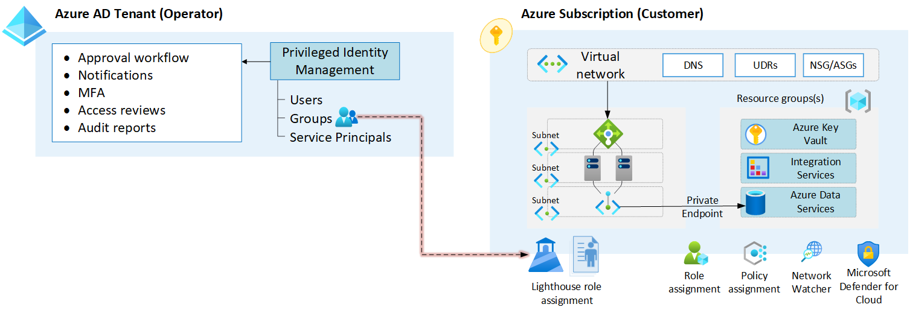
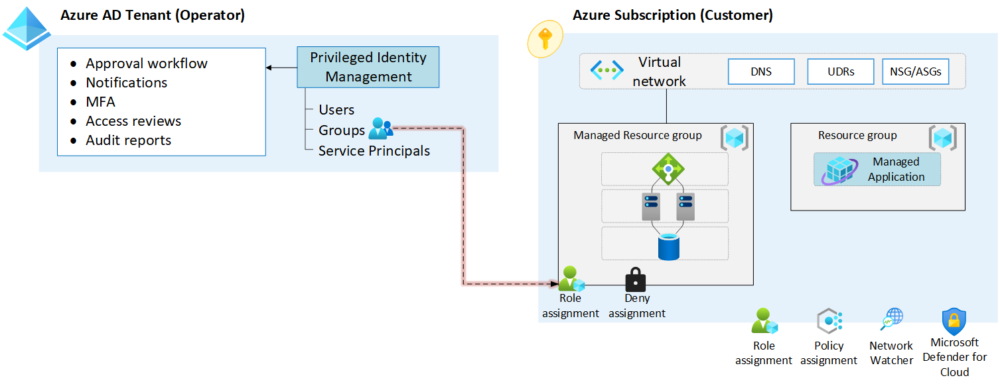

# Telco Services

Telcos who are running and hosting their Telco industry solutions on the Azure platform are commonly also managing and servicing other customers, whether it is in their own tenant, or directly in the customer's tenants.

This article enumerates the different methods a Telco on Azure can use in order to provide managed services or/and managed solutions to their customers, directly in the customer environments.

The following table explains the available capabilities, their pros and cons in order to meet the above. Note that all of these capabilities can also be combined and one does not exclude the other.

| Service/capability | Description | Pros | Cons |
|:-------------------------|:-------------|:-------------|------|
| Azure AD B2B | Azure AD B2B allows customers to directly invite users (guest) accounts from the Telco AAD, and can grant them any permission to manage the tenant as a whole, including Azure resources. | No limitations in terms of what permission that can be granted in the customer tenant across Microsoft Clouds (Azure AD, Office 365, Power Platform, Dynamics). | Requires explicit, manual onboarding from a customer perspective per user. Challenges for the service provider (telco) when they are managing multiple tenants as tenant context must be set explicitly prior to any operation for all clients. Co-admin scenario by design for the customer and the service provider, which can make it hard to have clear separation of duties.
| Azure Lighthouse | Enables a cross-tenant RBAC assignment so that service providers can manage the customer scopes that are delegated (subscription or resource groups) directly from within their tenant using a single token.  |Optimized for service providers to perform at-scale operations across multiple Azure tenants. Allows service providers to host and secure their intellectual properties in their own subscriptions. Interoperability across tenants from an Azure control plane perspective. Customer is in charge of the access scope given. | Owner RBAC is not supported, so several high privileged operations cannot be executed by the service provider. Limited to Azure ARM only (no Azure AD, Office 365, or Power Platform manageability). Co-admin scenario by design for the customer and the service provider, which can make it hard to have clear separation of duties.
| Azure Managed Application | Enables service providers and ISV's to publish their solutions into Azure marketplace offerings, where customer deploys into their subscription and the actual Azure resources are projected back to the service provider tenant (cross tenant RBAC assignment) for them to operate on-behalf-of the customers. | Optimized for ISV's/service providers to perform at-scale operations across multiple Azure tenants. Allow ISV's/service providers to host and secure their intellectual properties in their own subscriptions. Interoperability across tenants from an Azure control plane perspective. Service provider can determine the RBAC they need on the managed resource group themselves. Clear separation of duties as the managed resource group in the customer subscription is locked, preventing the customer to potentially cause service disruption. | Permission for ISV's/services are limited to the managed resourcre group only |

## Azure Lighthouse

Azure Lighthouse is primarily a capability for enterprises with Azure subscriptions spread across multiple Azure AD tenants, as well as for service providers to manage multiple Azure subscriptions across multiple customer Azure AD tenants. 

The following picture depicts how the cross-tenant RBAC authorization works, granting principal Id's from the remote Azure AD tenant permissions directly on a subscription or a resource group in a customer tenant.

For Telco's considering Azure Lighthouse to manage and operate their customers directly in their Azure subscription(s), the following consideratios and recommendations are provided.

### Design considerations

* Principal Id's in the Telco tenant can only be associated with Azure built-in RBAC, and the highest privilige that can be used is *Contributor*.
* Azure AD Privileged Identity Management can be leveraged on the Telco Azure AD tenant, providing additional security confirmation to their customers that users are subject to just-in-time access, access reviews, approval process, multi-factor authentication and more.
* All *write* operations (create, update, and delete) in the customer subscription(s) is transparent for both parties in the Azure Activity log.
* Customers can at any point in time remove the permissions given to users from the Telco Azure AD.
* When a customer grants access (via onboarding of the Telco), an event is written to the Telco's directory (tenant) activity log. The same happens when permission is revoked.
* Onboarding of a Telco managed service provider can only be done using an Azure Resource Manager template in the customer subscription.
* Telco's can provide their onboarding Azure Resource Manager template directly to customers, or publish their offerings into Azure Marketplace.

### Design recommendations

* When using Azure Lighthouse as a Telco managed service provider, ensure you have a good CI/CD approach to maintain and publish the Azure Resource Manager template(s) that are used for customer onboarding.
* If required by the customer, use Azure AD PIM to provide additional, enterprise security capabilities when accessing customer resources.
* Enable a notification workflow to monitor when new customers are either onboarding to the Telco managed service provider, or are revoking access.
* Use one or more dedicated subscriptions in the Telco tenant to host and run the requisite management services/tools to operate across multiple customer tenants.
* Ensure you have an Azure AD group present in the Azure Resource Manager template that is mapped to the *Managed Services Registration assignment Delete Role*, so you can opt-out from a customer if it's required.
* Use Azure AD Groups to organize the various personas and access requirements needed to operate the customers, so clear separation of duties from the Telco tenant is established.
* For updates required to the authorization needed for the Telco identities, the customer must re-deploy the Azure Resource Manager template with the changes for it to be reflected back to the Telco tenant.

## Azure Managed Application

Azure Managed Application is a capability for ISV's and service providers to deliver turn-key applications to Azure customers directly from the Azure marketplace. Customers deploy via self-service, and once provisioned, the ISV/service provider will have cross-tenant RBAC permission on the *managed resource group*, which contains all the required infrastructure for the services they are delivering, that customers can use and integrate with other Azure services they may have. 

The following picture depicts how the Managed Application construct works, and the cross-tenant RBAC authorization at the managed resource group scope, granting principal Id's from the remote Azure AD tenant permissions directly on the managed resource group in a customer tenant's Azure subscription.

For Telco's considering Azure Managed Application as a way to package, distribute, and operate their solutions, we provide the following design considerations and recommendations.

### Design considerations

* Managed Application requires Azure Resource Manager template(s) and a User Interface definition, that must be versioned and published to the Azure Marketplace via [Partner Center](https://partner.microsoft.com/dashboard/home).
* You can enable any customer subscription to purchase and deploy your Managed Application, or you can enable this per subscription(s) manually.
* When customer is deploying a Managed Application, they will see two resource groups where the managed resource group cannot be altered by the customer.
* Due to how the managed resource group is being locked (using deny assignment), only the Telco can access, create, and change the Azure resources within.
* When publishing a Managed Application, you must provide the users/groups/service principals from your Azure Active Directory who will operate the Managed Application in the customer subscriptions, and map towards built-in role-based access controls in Azure.
* Managed Applications can connect to your customer relationship management (CRM) system, such as Dynamics 365 Customer Engagement, HTTPS endpoint, Salesforce and more, so you can receive customer contact information when a customer deploys your product.
* When a customer deletes the Managed Application object, the managed resource group will then also be deleted.