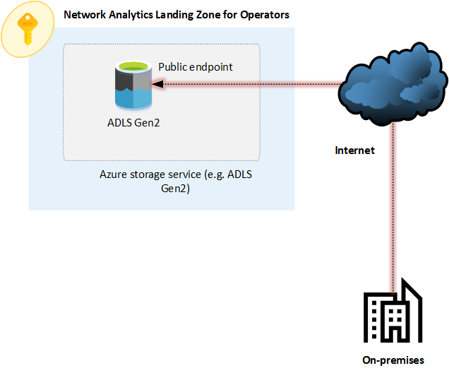
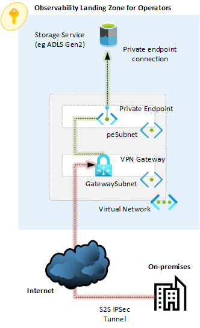
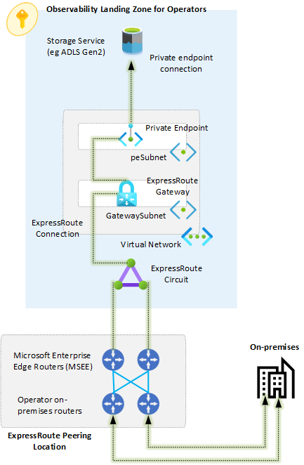
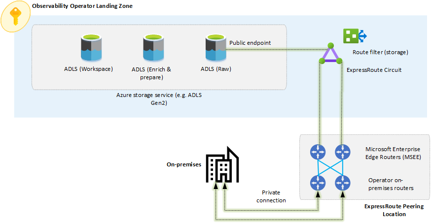
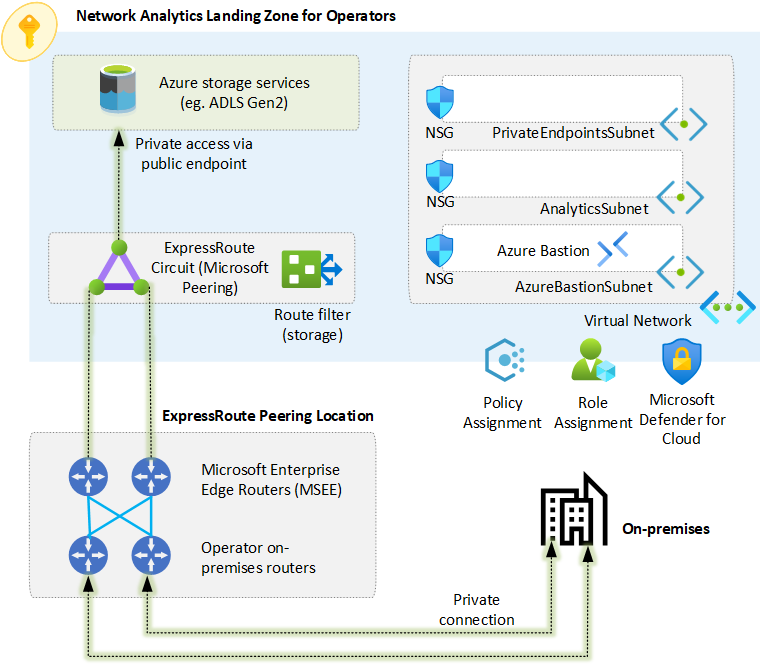
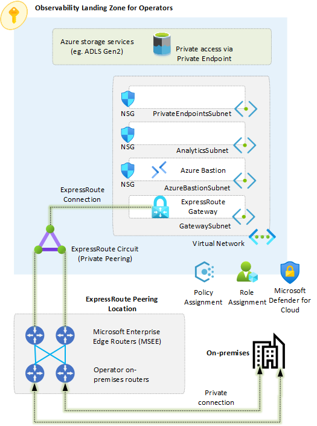

# Observability Landing Zone for Operators

Devices and equipment on operators on-premises locations (such as radio access networks or networking devices), generate large amounts of logs and files that not only need to be captured, but also, given the sheer amount of information, operators require a cloud native solution to aggregate, analyze and report the data to embrace data-driven solutions and decisions. For example, a use case would be to collect RAN logs to aggregate and analyze them to identify anomalies or interference.

An observability landing zone for operators provides the required foundational services on Azure to ingest large amounts of data into Azure storage services (such as Azure Data Lake Storage Gen2). Once this landing zone is provisioned, operators can simply deploy whichever data and analytics services and solutions they prefer to analyze the data.

This article provides design considerations and recommendations for observability landing zones for operators, and it also provides a reference implementation to accelerate and simplify the deployment of such landing zones.

* [Networking options](#networking-options)
  * [Internet](#internet)
  * [VPN](#vpn)
  * [ExpressRoute (Private Peering)](#expressroute-private-peering)
  * [ExpressRoute (Microsoft Peering)](#expressroute-microsoft-peering)
* [Observability Landing Zone types](#observability-landing-zone-types)
* [Reference implementation](#reference-implementation)

## Networking options

It is essential to define the network connectivity model to be used for the observability landing zone for operators, as it will provide the connectivity required to allow you to ingest (potentially) large amounts of data from your on-premises network into an Azure storage service.

While there are many multiple ways to connect an on-premises network to a landing zone in Azure, this section provides design considerations and recommendations to help you define the right network connectivity model for based on your scenarios and requirements. The following table summarizes the network connectivity options available:

| Option  | Pros  | Cons  |
|--- |--- |--- |
| Internet  | Simple to implement. No additional Azure networking costs involved. No Azure networking infrastructure required.  | Traffic traverses the public internet. Latency and bandwidth not guaranteed. Traffic is not encrypted by default. |
| VPN  | Traffic is encrypted via IPSec tunnels. Traffic to an Azure storage service can be kept private within an Azure VNet.  | Traffic traverses the public internet. It requires and Azure VPN gateway. The maximum bandwidth per IPSec tunnel is about 1Gbps and there are limits on the maximum number of tunnels. Azure storage service must be accessible via a private endpoint unless additional infrastructure is deployed in the Azure VNet.  |
| ExpressRoute (Private Peering)  | Traffic is not exposed to the public internet as it traverses a private connection. Predictable bandwidth and latency. 99.95% SLA availability. Scalable bandwidth up to 100 Gbps. FastPath can be enabled to remove the ExpressRoute Gateway from the data path.  | More complex to implement compared to an internet-based or VPN connection. It requires and ExpressRoute gateway. Azure storage service must be accessible via a private endpoint unless additional infrastructure is deployed in the Azure VNet.  |
| ExpressRoute (Microsoft Peering)  | Traffic is not exposed to the public internet, as it traverses a private connection. Predictable bandwidth and latency. 99.95% SLA availability. Scalable bandwidth up to 100 Gbps. It does not require an ExpressRoute gateway. The Azure storage service can be reached over its public endpoint via a private connection.  | More complex to implement compared to an internet-based or VPN connection. It requires usage of public IPs (although traffic traverses a private connection).  |

### Internet

This is the simplest option to provide connectivity from on-premises to an Azure storage service. This model requires that the Azure storage service is accessible over its public endpoint. Figure 1 below describes this scenario:

_Figure 1: Connectivity to Azure storage over the internet._

#### Design considerations

- Internet connections typically don't provide predictable bandwidth or latency.
- Traffic over the internet can be susceptible to malicious attacks and is strongly recommended that traffic over the internet is secured for example with a strong encryption algorithm.
- Many Azure storage services offer the possibility to lock down access to specific public IP addresses.
- A service or application would be required in the on-premises network to be able to push the data from on-premises to the Azure storage service (for example, using the [AzCopy](https://docs.microsoft.com/azure/storage/common/storage-use-azcopy-v10?toc=/azure/storage/blobs/toc.json) tool).

#### Design recommendations

- Use an internet-based connection for an observability landing zone for scenarios such as:
  - Small environments with small amounts of data.
  - Development and testing environments.
  - There are no requirements or regulations in your organization, industry or region to transmit corporate data over a public internet connection.
  - It is allowed in your organization to access an Azure storage service over its public endpoint.
- Always use strong encryption and secure protocols when transmitting data over the internet.
- Ensure your Azure storage services are configured to only accept connections using secure connections and protocols using strong encryption.
- Restrict access to only the public IP addresses that you will use to transmit data in the Azure storage service.
- Ensure no other public access is allowed in the Azure Storage service.

### VPN

An alternative connectivity model to an observability landing zone is by using a site-to-site (S2S) VPN connection as depicted in figure 2 below:

_Figure 2: Connectivity to Azure storage over VPN._

#### Design considerations

- Site-to-Site (IPsec/IKE VPN tunnel) configurations are between your on-premises location and Azure.
- This type of connection relies on an IPsec VPN appliance (hardware device or soft appliance), which must be deployed at the edge of your network. To create this type of connection, you must have an externally facing IPv4 address.
- An Azure VPN gateway (or a third-party network virtual appliance) is required on an Azure VNet. A VPN gateway sends encrypted traffic between your virtual network and your on-premises location across a public connection.
- Azure VPN gateway has different [SKUs](https://docs.microsoft.com/azure/vpn-gateway/vpn-gateway-about-vpngateways#gwsku) to support your specific routing, availability and scalability requirements.
- The maximum throughput of a site-to-site VPN connection is limited by IPsec to 1.25Gbps. However, multiple tunnels can be used, up to the maximum number of tunnels or aggregated throughput of your VPN gateway SKU.
- You cannot reach an Azure storage service over its public endpoint using a Site-to-Site VPN connection. Instead, you must make the Azure storage service accessible via a private endpoint, or you need to deploy Azure resources or services (such as a virtual machine or Azure Data Factory) in an Azure virtual network to move the data from on-premises to the Azure storage service over either, its public endpoint or via a private endpoint.
- Azure Private Endpoint is a metered service. Make sure you familiarize with its [pricing](https://azure.microsoft.com/pricing/details/private-link/), so that you can estimate expected costs depending on the amount of data to ingest.

#### Design recommendations

- Use a site-to-site VPN connection over the internet for an observability landing zone for scenarios such as:
  - Environments where the maximum aggregated throughput required is less than 10 Gbps.
  - There are no requirements or regulations in your organization, industry or region to transmit corporate data over a public internet connection as long as the connection is always encrypted.
  - In your organizations, it is not allowed to access an Azure storage service over its public endpoint. Access to Azure PaaS services must be done privately either by deploying them in the VNet or by accessing them via private endpoints.
- Plan carefully the Azure VPN Gateway [SKU](https://docs.microsoft.com/azure/vpn-gateway/vpn-gateway-about-vpngateways#gwsku) as each SKU supports different features (like availability zones support), scalability and throughput numbers.
- For maximum reliability, deploy the VPN gateway as [zone-redundant](https://docs.microsoft.com/azure/vpn-gateway/about-zone-redundant-vnet-gateways) (on Azure regions that support availability zones), unless you have a very specific requirement to deploy the VPN as zonal or regional.

### ExpressRoute (Private Peering)

Azure ExpressRoute provides private connectivity that does not traverse the public internet. Besides ensuring that network traffic is kept in a private network, predictable throughput and latency can be expected and ExpressRoute availability is backed by a 99.95% SLA. With private peering, all communication between on-premises and Azure is done via private IP addresses (typically RFC1918). A sample observability landing zone using ExpressRoute with private peering is depicted in figure 3 below:

_Figure 3: Connectivity to Azure via ExpressRoute with private peering_

#### Design considerations

- ExpressRoute lets you extend your on-premises networks into the Microsoft cloud over a private connection.
- ExpressRoute connections don't go over the public internet. This allows ExpressRoute connections to offer more reliability, faster speeds, consistent latencies, and higher security than typical connections over the internet.
- Azure compute services, namely virtual machines (IaaS) and cloud services (PaaS), that are deployed within a virtual network can be connected through the private peering domain. The private peering domain is considered to be a trusted extension of your core network into Microsoft Azure. You can set up bi-directional connectivity between your core network and Azure virtual networks (VNets). This peering lets you connect to virtual machines and cloud services directly on their private IP addresses.
  - To access Azure PaaS services from on-premises via ExpressRoute private peering, they must be deployed either in the VNet or must be accessible using a private endpoint.
  - Note that private endpoint is a metered Azure service. Make sure you familiarize with its [pricing](https://azure.microsoft.com/pricing/details/private-link/), so that you can estimate expected costs depending on the amount of data to ingest.
- To connect your Azure virtual network and your on-premises network via ExpressRoute, you must create a virtual network gateway first. A virtual network gateway serves two purposes: exchange IP routes between the networks and route network traffic.
- Before you create an ExpressRoute gateway, you must create a gateway subnet, which must be named _GatewaySubnet_.
- The ExpressRoute gateway can be deployed as regional, [zonal or zone-redundant](https://docs.microsoft.com/azure/expressroute/expressroute-about-virtual-network-gateways#gwsub).
- FastPath, when enabled, sends network traffic directly to virtual machines in the virtual network, bypassing the ExpressRoute gateway.
  - Please note that FastPath have some [limitations](https://docs.microsoft.com/azure/expressroute/about-fastpath#limitations)
- ExpressRoute Direct gives you the ability to connect directly into Microsoft’s global network at peering locations strategically distributed around the world. ExpressRoute Direct provides dual 100 Gbps or 10-Gbps connectivity, which supports Active/Active connectivity at scale.

#### Design recommendations

- Use a private connection based on ExpressRoute with private peering for an observability landing zone for scenarios such as:
  - Large environments with large amounts of data.
  - Production environments.
  - Mission critical environments.
  - There are requirements or regulations in your organization, industry or region that require you to transmit corporate data over private connections exclusively, avoiding internet-based connections.
  - It is not allowed in your organization to access an Azure storage service over its public endpoint. Access to Azure storage services must be done over private endpoints.
- Use ExpressRoute direct if you require more than 10Gbps bandwidth.
- When using ExpressRoute private peering:
  - Ensure the Azure storage service (such as ADLS Gen2) is accessible via a private endpoint.
  - Enable FastPath on the ExpressRoute connection. This will remove the ExpressRoute Gateway from the data path. Note that it is still required for control plane operations.

### ExpressRoute (Microsoft Peering)

Azure ExpressRoute provides a private connectivity that does not traverses the public internet. Thus, besides ensuring that network traffic is kept in a private network, predictable throughput and latency can be expected and ExpressRoute availability is backed by a 99.95% SLA. With Microsoft peering, all communication between on-premises and Azure is done via public IP addresses, that need to be verified by Microsoft. With Microsoft peering, it is possible to reach Azure storage services over a private connection and directly to their public endpoint without requiring any additional infrastructure on Azure. A sample observability landing zone using ExpressRoute with Microsoft peering is depicted in figure 4 below:

_Figure 4: Connectivity to Azure via ExpressRoute with Microsoft peering_

#### Design considerations

- ExpressRoute lets you extend your on-premises networks into the Microsoft cloud over a private connection.
- ExpressRoute connections don't go over the public internet. This allows ExpressRoute connections to offer more reliability, faster speeds, consistent latencies, and higher security than typical connections over the internet.
- Connectivity to Microsoft online services (Microsoft 365 and Azure PaaS services) occurs through Microsoft peering. Microsoft enables bi-directional connectivity between your WAN and Microsoft cloud services through the Microsoft peering routing domain.
- With ExpressRoute Microsoft peering you don't need an ExpressRoute gateway as you can access Azure PaaS services directly over their public endpoint.
  - This setup may reduce your data transfer costs, as you don't need a private endpoint for the purpose of uploading data from on-premises into an Azure storage service (such as ADLS Gen2).
- With ExpressRoute Microsoft peering, you must use public IP addresses that you own for setting up the BGP sessions. Microsoft must be able to verify the ownership of the IP addresses through routing internet registries and internet routing registries.
- When Microsoft peering gets configured in an ExpressRoute circuit, all prefixes related to these services gets advertised through the BGP sessions that are established. A BGP community value is attached to every prefix to identify the service that is offered through the prefix.
- If you plan to consume only a subset of services offered through Microsoft peering, you can reduce the size of your route tables in two ways. You can:
  - Filter out unwanted prefixes by applying route filters on BGP communities.
  - Define route filters and apply them to your ExpressRoute circuit. A [route filter](https://docs.microsoft.com/azure/expressroute/how-to-routefilter-portal) is a resource that lets you select the list of services you plan to consume through Microsoft peering. ExpressRoute routers only send the list of prefixes that belong to the services identified in the route filter.
- ExpressRoute Direct gives you the ability to connect directly into Microsoft’s global network at peering locations strategically distributed around the world. ExpressRoute Direct provides dual 100 Gbps or 10-Gbps connectivity, which supports Active/Active connectivity at scale.

#### Design recommendations

- Use a private connection based on ExpressRoute with Microsoft peering for an observability landing zone for scenarios such as:
  - Large environments with large amounts of data.
  - Production environments.
  - Mission critical environments.
  - There are requirements or regulations in your organization, industry or region that require you to transmit corporate data over private connections exclusively, avoiding internet-based connections.
  - Access to Azure storage services over their public endpoint is allowed.
- Ensure Azure storage service is configured to only accept traffic from the public IP addresses that you use for your ExpressRoute Microsoft peering connection.
- Use Azure route filters and configure them to the Azure service and region that you require. This will ensure that Microsoft will only advertise the IP prefixes required (instead of advertising prefixes for all services).
- Use ExpressRoute direct if you require more than 10Gbps bandwidth.

## Observability Landing Zone types

Depending the networking option you select for your observability landing, you would require an _online_, _corporate_ or _operator_ landing zone as per the guidance in table 1 below:

| Connectivity Model  | Landing Zone Type  | Connectivity Provided by  | Details  |
|--- |--- |--- |--- |
| Internet  | Online  | Landing Zone owner  |   |
| VPN  | Corporate  | Platform  |   |
| ExpressRoute (Private Peering)  | Corporate  | Platform  | When using connectivity provided by hub or virtual hub network  |
| ExpressRoute (Private Peering)  | Operator  | Landing Zone owner  | When deploying ExpressRoute gateway within the landing zone  |
| ExpressRoute (Microsoft Peering)  | Operator  | Landing Zone owner  |   |

_Table 1: Observability Landing Zones depending on the network connectivity model_

## Reference implementation

| Reference implementation  | Description  | Deploy  |
|--- |--- |--- |
| Observability Landing Zone for Operators  | Observability landing zone for operators with required infrastructure for data ingestion into an Azure storage service and ready for deployment of storage services (such as ADLS Gen2) an analytics solutions (such as Azure Synapse).   | [User guide](./userGuide/readme.md)   |

This reference implementation is intended for landing zone owners for them to deploy observability landing zones for operators. This reference implementation allows the deployment of observability landing zones for operators using two network connectiviity models:

- ExpressRoute with Microsoft Peering (see figure 5).
- ExpressRoute with Private Peering (see figure 6).

_Figure 5: Observability Landing Zones for Operator with ExpressRoute Microsoft Peering_

_Figure 6: Observability Landing Zones for Operator with ExpressRoute Microsoft Peering_

As figures 5 and 6 depict, the Observability Landing Zones reference implementation deploys and configures several Azure resources. The list of resources are described in table 2 below along with a description. Once the Observability Landing Zones reference implementation deploys those resources, the landing zone is ready for the deployment of Azure storage and Azure analytical services that you would require for your own environment.

Table 2 below also provides links to the deployment guides which include step-by-step deployment instructions for your observability landing zone. Table 2 also provides links to the observability solution accelerator to help you deploy and configure data and analitical services in your landing zone.

| Azure resource | Deployed by | Details | Deploy |
|---|---|---|---|
| Azure subscription | Platform team | Azure subscription is provided by the platform team and deployed under the Operator management group | [AfO Landing Zones User Guide](../../referenceImplementation/readme.md) |
| DNS | Platform team | DNS name resolution is provided by the platform team via VNet peering to central hub VNet. Note that landing zone owners can optionally deploy a dedicated DNS infrastructure within the observability landing zone if required | [AfO Landing Zones User Guide](../../referenceImplementation/readme.md) |
| ExpressRoute circuit | Landing Zone owner | Optional, as an existing ExpressRoute circuit can be used | [Observability Landing Zones User Guide](./userGuide/readme.md)   |
| Route filter | Landing Zone owner | Deployed in case of implementing ExpressRoute with Microsoft peering | [Observability Landing Zones User Guide](./userGuide/readme.md) |
| ExpressRoute gateway | Landing Zone owner | Deployed in case of implementing ExpressRoute with Private peering | [Observability Landing Zones User Guide](./userGuide/readme.md) |
| ExpressRoute connection | Landing Zone owner | Deployed in case of implementing ExpressRoute with Private peering | [Observability Landing Zones User Guide](./userGuide/readme.md) |
| Virtual network | Landing Zone owner |  | [Observability Landing Zones User Guide](./userGuide/readme.md) |
| NSGs | Landing Zone owner |  | [Observability Landing Zones User Guide](./userGuide/readme.md) |
| Azure Bastion | Landing Zone owner |  | [Observability Landing Zones User guide](./userGuide/readme.md) |
| Azure storage service(s) | Landing Zone owner | Any Azure storage service(s) required by the landing zone owner (such as Azure Data Lake Storage Gen2) | Solution Accelerator (coming soon) |
| Private Endpoints | Landing Zone owner |  | Solution Accelerator (coming soon) |
| Analytics services | Landing Zone owner | Any analytics service(s) as required by the landing zone owner (for example Azure Synapse) | Solution Accelerator (coming soon) |

_Table 2: Resources deployed by the Obervability Landing Zones reference implementation_
