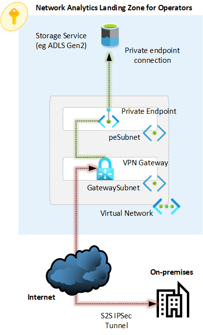

# Observability and Analytics for Operators

Devices and equipment on operators on-premises infrastructure (such as radio access networks, or RAN), generate large amounts of logs and files that not only need to be captured, but also, given the sheer amount of information, operators require a cloud native solution to aggregate, analyze and report the data to embrace data-driven solutions and decisions. For example, a use case would be to collect RAN logs to aggregate and analyze them to identify annomalies or interference.

This article describes an observability and analytics pattern and how it can be deployed on an operator landing zone. This article provides also a reference implementation to simplify the deployment of such landing zone.

* [Networking](#networking)
* [ELT](#elt)
* [Analytics](#analytics)
* [Reporting](#reporting)
* [Sample observability and analytics landing zone for operators](#sample-observability-and-analytics-landing-zone-for-operators)

## Networking

It is essential to define how the operator will connect to an operator landing zone to send potentially massive amounts of data to Microsoft Azure. While there are many possibilities how to connect to the operator landing zone, this article provides design considerations and recommendations for defining the right connectivity model for data ingestion into an operator landing zone.

There are multiple ways to connect an on-premises environmetn to Azure with the purpose of ingesting large amounts of data into an Azure data service (such as Azure Datalake Storage Gen2). The following table summarizes the options available:

| Option 	| Pros 	| Cons 	|
|---	|---	|---	|
| Internet 	| Simple to implement. No additional Azure networking costs. No Azure networking infrastructure required. 	| Traffic traverses the public internet. Latency and bandwidth not guaranteed. 	|
| VPN 	| Traffic is encrypted via IPSec tunnels. Traffic can be kept private within an Azure VNet. 	| Traffic traverses the public internet. It requires and Azure VPN gateway. The maximum bandwidth per IPSec tunnel is about 1Gbps and there are limits on the maximum number of tunnels. Azure storage service may be required to be accessible using a private endpoint, which is a metered service. 	|
| ExpressRoute (Private Peering) 	| Traffic is not exposed to the public internet as it traverses a private connection. Predictable bandwidth and latency. 99.95% SLA availability. Scalable bandwidth up to 100 Gbps. FastPath can be enabled to remove the ExpressRoute Gateway from the data path. 	| More complex to implement compared to an internet-based or VPN connection. It requires and ExpressRoute gateway. It may require the Azure storage service to be accessible using a private endpoint, which is a metered service. 	|
| ExpressRoute (Microsoft Peering) 	| Traffic is not exposed to the public internet, as it traverses a private connection. Predictable bandwidth and latency. 99.95% SLA availability. Scalable bandwidth up to 100 Gbps. It does not require an ExpressRoute gateway. The Azure storage service can be reached over its public endpoint via a private connection. 	| More complex to implement compared to an internet-based or VPN connection. It requires usage of public IPs (although traffic traverses a private connection). 	|

### Internet

This is the simplest option to provide connectivity from on-premises to an Azure storage service that is accessible over its public endpoint. The picture below describes this scenario:

_Figure 1: Connectivity to Azure storage over the internet._

#### Design considerations

#### Design recommendations

### VPN

An alternative to connecting directly to Azure storage services over the internet is by connecting to Azure using a site-to-site (S2S) VPN connection as depicted in figure 2 below:

_Figure 2: Connectivity to Azure storage over VPN._

#### Design considerations

#### Design recommendations

### ExpressRoute (Private Peering)

ExpressRoute provides a private connectivity that does not traverses the public internet. Thus, besides ensuring that all data is kept in a private network, predictable throughput and latency can be expected and ExpressRoute availability is backed by a 99.95% SLA. With private peering, all communication between on-premises and Azure is done via private IP addresses (typically RFC1918). This setup is depicted in figure 3 below:

_Figure 3: Connectivity to Azure via ExpressRoute with private peering_

#### Design considerations

#### Design recommendations

### ExpressRoute (Microsoft Peering)

- Use ExpressRoute as the main option to connect the on-premises operator network to Azure.
- Use ExpressRoute direct if you require more than 10Gbps bandwidth.
- Use ExpressRoute private peering when there is a relatively low amount of data to be ingested.
- When using ExpressRoute private peering:
  - Ensure the Azure storage service (such as ADLS Gen2) is accesible via a private endpoint.
  - Enable FastPath on the ExpressRoute connection. This will remove the ExpressRoute Gateway from the data path. Note that it is still required for control plane operations.

## ELT

### Ingest

### Storage

#### Raw
#### Enrich and prepare
#### Workspace

## Analytics

Logic, algorithms, statistics

## Reporting

Visualize
Explain data

## Sample observability and analytics landing zone for operators

