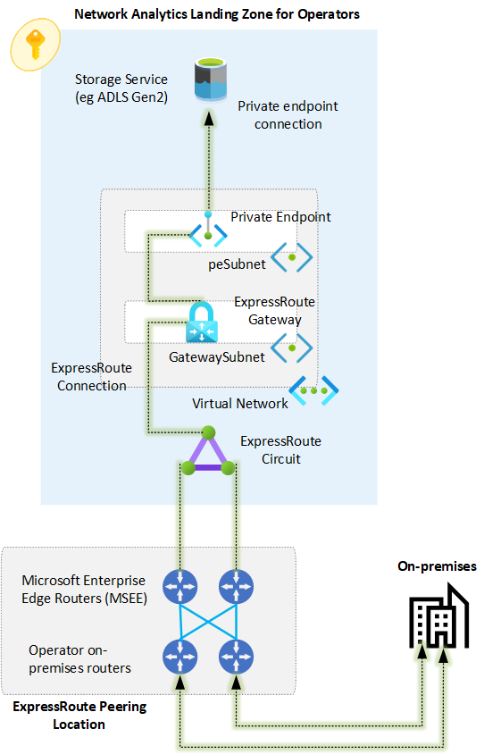
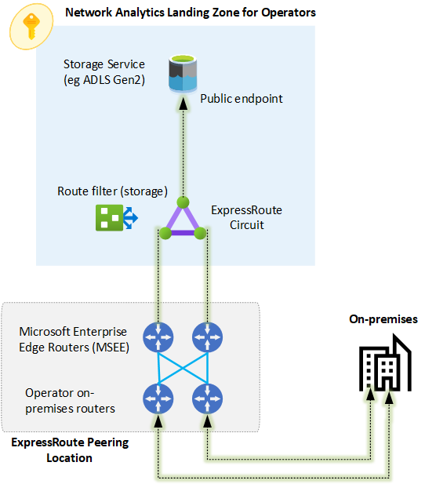

# Observability Landing Zone for Operators

Devices and equipment on operators on-premises infrastructure (such as radio access networks, or RAN), generate large amounts of logs and files that not only need to be captured, but also, given the sheer amount of information, operators require a cloud native solution to aggregate, analyze and report the data to embrace data-driven solutions and decisions. For example, a use case would be to collect RAN logs to aggregate and analyze them to identify annomalies or interference.

An observability landing zone for operators provides the nfrastructure foundations on Azure so that all required foundational services required to ingest large amounts of data into an Azure storage service are provided by the observability landing zone for operators. Once this landing zone is provisioned, operators can simply deploy whichever data and analytics solution they prefer to analyze and report the data.

This article describes the design considerations and recommendations for an observability landing zone, and it also provides a deployment experience to simplify the deployment of such landing zone.

* [Networking options](#networking-options)
  * [Internet](#internet)
  * [VPN](#vpn)
  * [ExpressRoute (Private Peering)](#expressroute-private-peering)
  * [ExpressRoute (Microsoft Peering)](#expressroute-microsoft-peering)
* [Landing Zone type](#landing-zone-type)
* [Reference implementation](#reference-implementation)

## Networking options

It is essential to define how the operator will connect to an operator landing zone to send potentially massive amounts of data to Microsoft Azure. While there are many possibilities how to connect to the operator landing zone, this article provides design considerations and recommendations for defining the right connectivity model for data ingestion into an operator landing zone.

There are multiple ways to connect an on-premises environmetn to Azure with the purpose of ingesting large amounts of data into an Azure data service (such as Azure Datalake Storage Gen2). The following table summarizes the options available:

| Option 	| Pros 	| Cons 	|
|---	|---	|---	|
| Internet 	| Simple to implement. No additional Azure networking costs. No Azure networking infrastructure required. 	| Traffic traverses the public internet. Latency and bandwidth not guaranteed. 	|
| VPN 	| Traffic is encrypted via IPSec tunnels. Traffic can be kept private within an Azure VNet. 	| Traffic traverses the public internet. It requires and Azure VPN gateway. The maximum bandwidth per IPSec tunnel is about 1Gbps and there are limits on the maximum number of tunnels. Azure storage service may be required to be accessible using a private endpoint, which is a metered service. 	|
| ExpressRoute (Private Peering) 	| Traffic is not exposed to the public internet as it traverses a private connection. Predictable bandwidth and latency. 99.95% SLA availability. Scalable bandwidth up to 100 Gbps. FastPath can be enabled to remove the ExpressRoute Gateway from the data path. 	| More complex to implement compared to an internet-based or VPN connection. It requires and ExpressRoute gateway. It may require the Azure storage service to be accessible using a private endpoint, which is a metered service. 	|
| ExpressRoute (Microsoft Peering) 	| Traffic is not exposed to the public internet, as it traverses a private connection. Predictable bandwidth and latency. 99.95% SLA availability. Scalable bandwidth up to 100 Gbps. It does not require an ExpressRoute gateway. The Azure storage service can be reached over its public endpoint via a private connection. 	| More complex to implement compared to an internet-based or VPN connection. It requires usage of public IPs (although traffic traverses a private connection). 	|

### Internet

This is the simplest option to provide connectivity from on-premises to an Azure storage service that is accessible over its public endpoint. The picture below describes this scenario:

_Figure 1: Connectivity to Azure storage over the internet._

#### Design considerations

- Internet connections typically don't provide predictable bandwidth or latency.
- Traffic over the internet can be succeptible to malicious attacks unless traffic is secured for example with a strong encryption algoritm.
- Many Azure storage services offer the possibility to lock down access to specific public IP addresses.
- A service or application would required in the on-premises network to be able to push the data to the Azure Storage service.

#### Design recommendations

- Use an internet-based connection for data ingestion scenarios for scenarios such as: 
  - Small environments with small amounts of data.
  - Devolpment and testing environments.
  - There are no requirements or regulations in your organization, industry or region to transmit corporate data over a public internet connection.
  - It is allowed in your organization to access an Azure storage service over its public endpoint.
- Always use strong encryption and secure protocols when transmitting data over the internet.
- Restrict access to only the public IP addresses that you will use to transmit data in the Azure storage service.
- Ensure no other public access is allowed in the Azure Storage service.

### VPN

An alternative to connecting directly to Azure storage services over the internet is by connecting to Azure using a site-to-site (S2S) VPN connection as depicted in figure 2 below:

_Figure 2: Connectivity to Azure storage over VPN._

#### Design considerations

- Site-to-Site (IPsec/IKE VPN tunnel) configurations are between your on-premises location and Azure.
- This type of connection relies on an IPsec VPN appliance (hardware device or soft appliance), which must be deployed at the edge of your network. To create this type of connection, you must have an externally facing IPv4 address.
- An Azure VPN gateway is required on an Azure VNet. A VPN gateway sends encrypted traffic between your virtual network and your on-premises location across a public connection.
- Azure VPN gateway has different [SKUs](https://docs.microsoft.com/azure/vpn-gateway/vpn-gateway-about-vpngateways#gwsku) depending on your routing, availability and scalability requirements.
- The maximum throughput of a site-to-site VPN connection is limtied by IPsec to 1.25Gbps. However, multiple tunnels can be used, up to the maximum number of tunnels or aggregated througput of your VPN gateway SKU.
- You cannot reach an Azure storage service over its public endpoint using a Site-to-Site VPN connection. Instead, you must make the Azure storage service accesible via a private endpoint, or you need to deploy an Azure resource or service (such as a virtual machine or Azure Data Factory) in an Azure virtual network that has VPN connectivity (directly or via VNet peering) to move the data from on-premises to the Azure storage service accesible over either, its public endpoint or via a private endpoint.

#### Design recommendations

### ExpressRoute (Private Peering)

ExpressRoute provides a private connectivity that does not traverses the public internet. Thus, besides ensuring that network traffic is kept in a private network, predictable throughput and latency can be expected and ExpressRoute availability is backed by a 99.95% SLA. With private peering, all communication between on-premises and Azure is done via private IP addresses (typically RFC1918). This setup is depicted in figure 3 below:

_Figure 3: Connectivity to Azure via ExpressRoute with private peering_

#### Design considerations

#### Design recommendations

- Use ExpressRoute as the main option to connect the on-premises operator network to Azure.
- Use ExpressRoute direct if you require more than 10Gbps bandwidth.
- When using ExpressRoute private peering:
  - Ensure the Azure storage service (such as ADLS Gen2) is accesible via a private endpoint.
  - Enable FastPath on the ExpressRoute connection. This will remove the ExpressRoute Gateway from the data path. Note that it is still required for control plane operations.

### ExpressRoute (Microsoft Peering)

ExpressRoute provides a private connectivity that does not traverses the public internet. Thus, besides ensuring that network traffic is kept in a private network, predictable throughput and latency can be expected and ExpressRoute availability is backed by a 99.95% SLA. With Microsoft peering, all communication between on-premises and Azure is done via public IP addresses, that need to be verified by Microsoft. With Microsoft peering, it is possible to reach Azure storage services over a private connection and directly to their public endpoint without required any additional infrastructure on Azure. This setup is depicted in figure 4 below:

_Figure 4: Connectivity to Azure via ExpressRoute with Microsoft peering_

#### Design considerations

#### Design recommendations

- Use ExpressRoute as the main option to connect the on-premises operator network to Azure.
- Use ExpressRoute direct if you require more than 10Gbps bandwidth.

## Landing Zone type

Depending the networking option you select for your observability landing zone for operators, you can create an online, corp or operator landing zone as per the guidance in the table below:

| Connectivity model 	| Landing Zone type 	|
|---	|---	|
| Internet 	| Online 	|
| VPN 	| Corporate 	|
| ExpressRoute (Private Peering) 	| Corporate, Operator* 	|
| ExpressRoute (Microsoft Peering) 	| Operator 	|

The * character indicates that, if the ExpressRoute gateway must be deployed within the landing zone itself, then an Operator landing zone is required.

## Reference implementation
