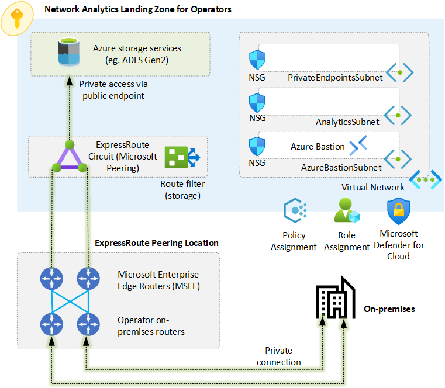
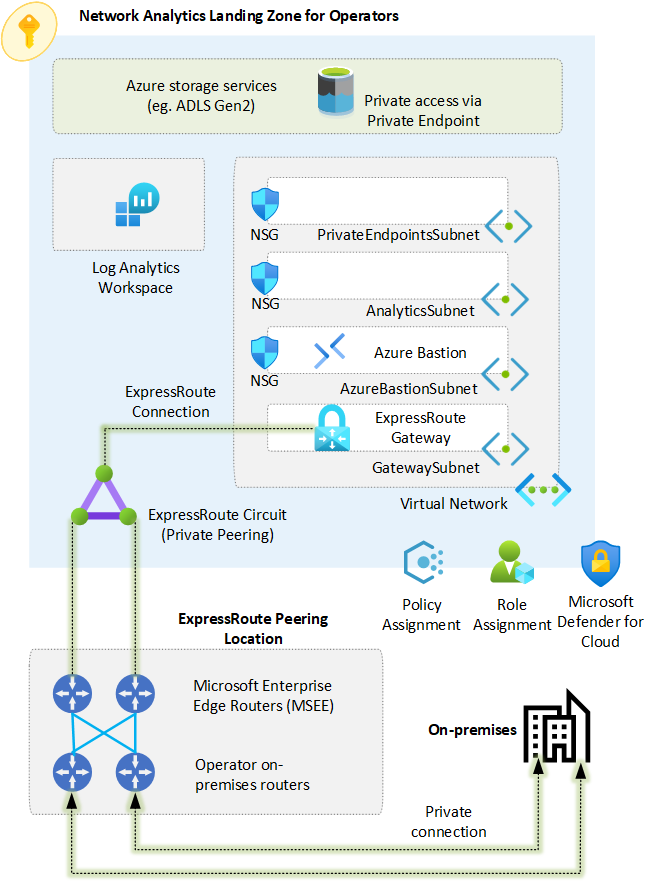
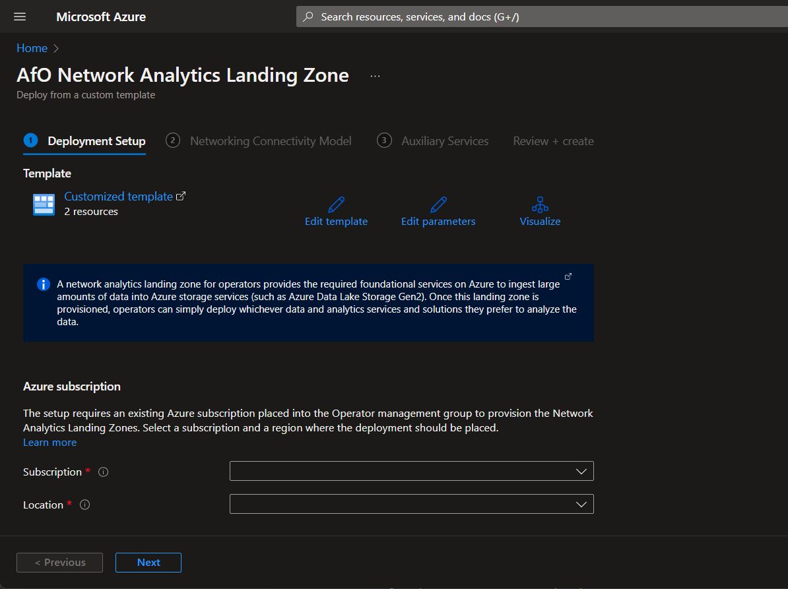
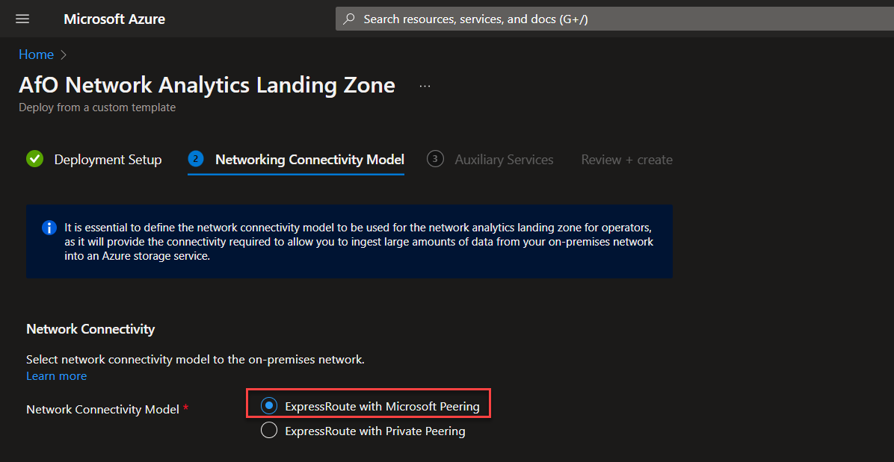
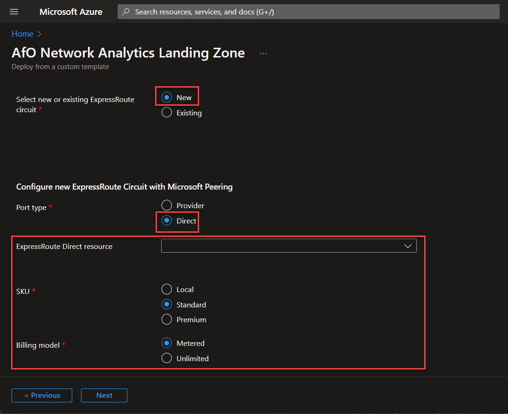
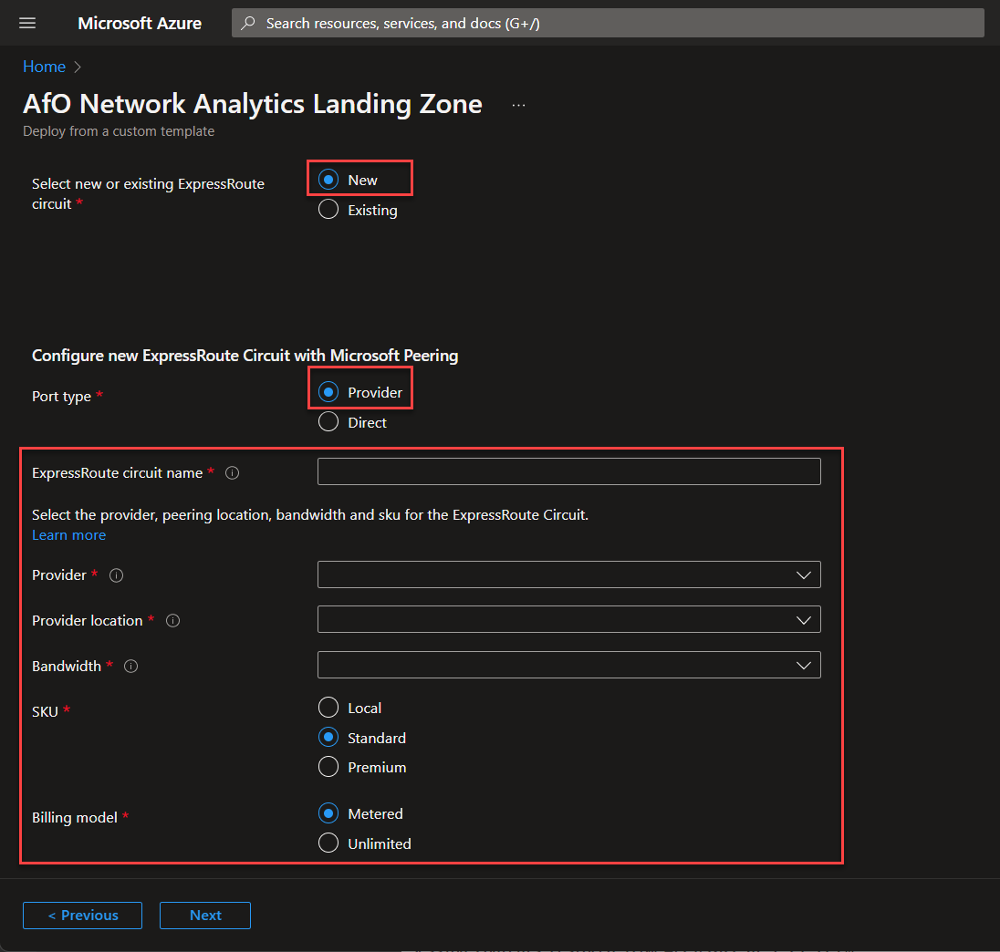
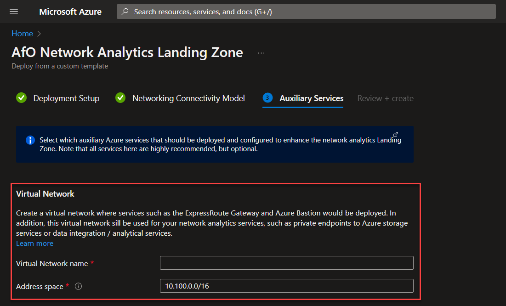
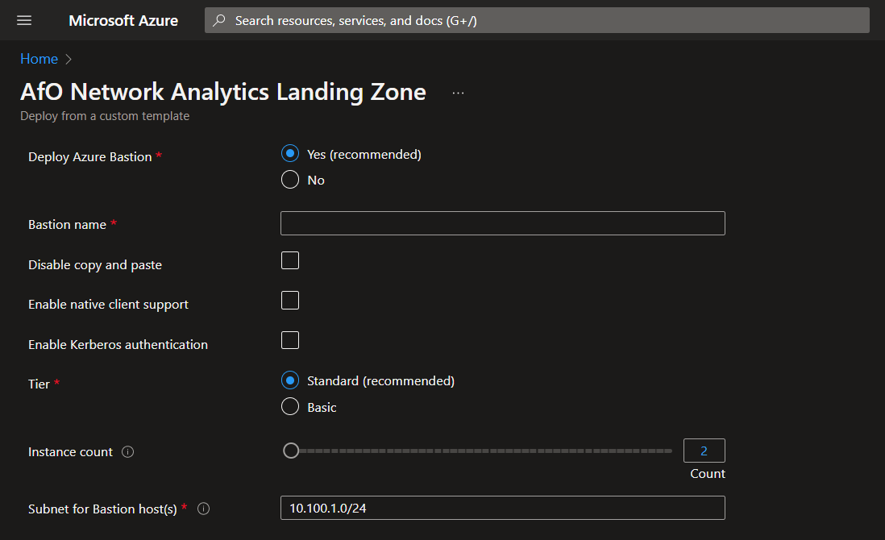
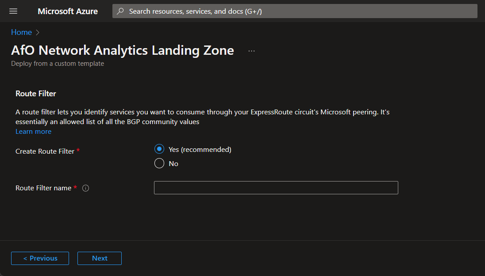
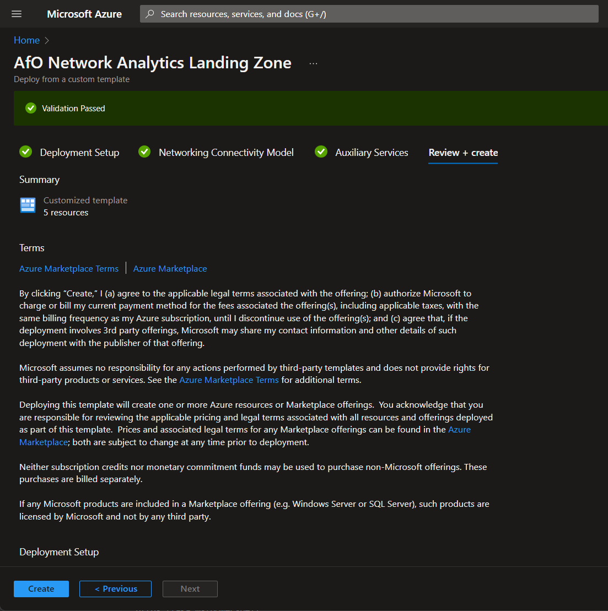

# Observability Landing Zone for Operators - User Guide

This user guide explains the Observability Landing Zone for Operators reference implementation, what it is, what it does, how organizations within the telecommunication industry can use it to run their carrier-grade observability workloads on a sustainable, scalable, and reliable Azure architecture.

| Reference Implementation | Description | Deploy |
|:----------------------|:------------|--------|
| Observability Landing Zone | An observability landing zone for operators provides the required foundational services on Azure to ingest large amounts of data into Azure storage services |

## Table of contents

- [What is the Observability Landing Zone for Operators reference implementation?](#what-is-the-observability-landing-zone-for-operators-reference-implementation)
- [What happens when you deploy the Observability Landing Zone for Operators reference implementation?](#what-happens-when-you-deploy-the-observability-landing-zone-for-operators-reference-implementation)
- [Deployment instructions](#deployment-instructions)
  - [ExpressRoute with Microsoft Peering](#expressroute-with-microsoft-peering)
  - [ExpressRoute with Private Peering](#expressroute-with-private-peering)

---

## What is the Observability Landing Zone for Operators reference implementation?

An observability landing zone for operators provides the required foundational services on Azure to ingest large amounts of data into Azure storage services (such as Azure Data Lake Storage Gen2). Once this landing zone is provisioned, operators can simply deploy whichever data and analytics services and solutions they prefer to analyze the data.

The reference implementation ties together all the Azure platform primitives and creates a proven, well-defined landing zone, leveraging native platform capabilities to ensure organizations in the telecommunication industry can deploy observability workloads in Azure at scale.

---

## What happens when you deploy the Observability Landing Zone for Operators reference implementation?

The Observability Landing Zone for Operators reference implementation will configure an Azure subscription that has been deployed (or moved under) the **Landing Zones > Operator** Management Group and deploy all required infrastructure so that you can simply deploy and configure the observability workload of your preference. The reference implementation allows you to choose from two networking connectivity models. Depending on the network connectivy model, certain infrastructure will be deployed and configured. Figure 1 and table 1 below describes the resources that are deployed when you choose the ExpressRoute with Microsoft Peering connectivity model, while figure 2 and table 2 below describe the resources that are deployed when you choose the ExpressRoute with Private Peering connectivity model

Figure 1 - Observability Landing Zone using ExpressRoute with Microsoft Peering connectivity

| Resource | Required | Description |
|---|---|---|
| ExpressRoute circuit (Microsoft Peering) | Yes | The reference implementation allows you to bring an existing pre-configured ExpressRoute circuit with Microsoft Peering, or it allows you to create a new ExpressRoute circuit. |
| Route Filter | Optional | Optional resource in case a new ExpressRoute circuit is created. The route filter can be configured to only receive the prefixes of the Azure Storage service and Azure region that you require. |
| Virtual Network | Yes | Azure virtual network where you will deploy your observability resources (for example, Azure Data Factory or a Spark cluster). |
| Azure Bastion | Optional | Azure Bastion host to allow you to connect to any virtual machines that you deploy in the virtual network. |
| Log Analytics Workspace | Optional | Log Analytics workspace to monitor the resources in your observability landing zone. |
| Azure Managed Grafana (Preview) | Optional | Azure Managed Grafana lets you bring together all your telemetry data into one place. |

Table 1 - Observability Landing Zone using ExpressRoute with Microsoft Peering connectivity

Figure 2 - Observability Landing Zone using ExpressRoute with Private Peering connectivity

| Resource | Required | Description |
|---|---|---|
| ExpressRoute circuit (Private Peering) | Yes | The reference implementation allows you to bring an existing pre-configured ExpressRoute circuit with Private Peering, or it allows you to create a new ExpressRoute circuit. |
| ExpressRoute Gateway | Optional | ExpressRoute Gateway deployed within the observability landing zone. If the gateway is deployed on a region that supports availability zones, the reference implementation will allow you to deploy the gateway as zone redundant. |
| Connection | Optional | If you bring an existing pre-configured ExpressRoute circuit with Private Peering, the reference implementation allows you to deploy a new ExpressRoute connection. |
| Virtual Network | Yes | Azure virtual network where you will deploy your observability resources (for example, Azure Data Factory or a Spark cluster). |
| Azure Bastion | Optional | Azure Bastion host to allow you to connect to any virtual machines that you deploy in the virtual network. |
| Log Analytics Workspace | Optional | Log Analytics workspace to monitor the resources in your observability landing zone. |
| Azure Managed Grafana (Preview) | Optional | Azure Managed Grafana lets you bring together all your telemetry data into one place. |

Table 2 - Observability Landing Zone using ExpressRoute with Microsoft Peering connectivit

Once the Observability Landing Zones for Operators reference implementation completes (independently of which network connectivity model you choose), your landing zone will be ready for you to simply deploy the Azure storage and Analytical services of your choice to light-up your observability landing zone.

---

## Deployment instructions

This section will explain the deployment experience and the options provided for the Observability Landing Zone for Operators reference implementation.

1. When you click on [Deploy to Microsoft Cloud](https://aka.ms/observabilitylz), the Azure portal will load and it will start the deployment experience into your default Azure tenant. In case you have access to multiple tenants, ensure you are selecting the right one.
2. On the **Deployment Setup** tab, select the Azure subscription that you want to use as your observability landing zone, and select the Azure region where the Azure resources will be deployed. Once you have made your selections, click on Next.

3. On the **Network Connectivity Model** tab, specify whether your Observability Landing Zone will use ExpressRoute with Microsoft Peering or Private Peering for connectivity to the on-premises network. Depending on your selection, proceed to either the ExpressRoute with Microsoft Peering or ExpressRoute with Private Peering sections.

### ExpressRoute with Microsoft Peering

1. In the **Networking Connectivity Model** tab, select **ExpressRoute with Microsoft Peering** option under **Network Connectivity Model** section.

2. After you selected **ExpressRoute with Microsoft Peering**, select whether you want to create a new ExpressRoute circuit or if you want to use an existing one. If you want to use an existing circuit, select **Existing** under the **Select new or existing ExpressRoute circuit** section (please ensure the circuit is configured with Microsoft peering and ready to use) and click on **Next**. If you want to create a new circuit, select **New** under the **Select new or existing ExpressRoute circuit** section and the **Configure new ExpressRoute Circuit with Microsoft Peering** section will be displayed

3. If you want to create a new ExpressRoute circuit from an existing ExpressRoute Direct port pair, select **Direct** under **Port type**. Then provide the following information and click on **Next**.
  - In the **ExpressRoute Direct resource** field select the ExpressRoute Direct resource where the new ExpressRoute circuit will be created.   
  - ExpressRoute circuit **SKU** (Local, Standard or Premium)
  - Note that the **Billing model** is set to Metered for ExpressRoute Direct circuits with Standard or Premium SKU, and Unlimited for Local SKU.

4. If you want to create a new ExpressRoute circuit using a service provider, select **Provider** under **Port type**. Then provide the following information and click on **Next**.
  - A name for the new ExpressRoute circuit
  - The service provider to use
  - The provider location
  - ExpressRoute circuit **bandwidth**
  - ExpressRoute circuit **SKU** (Local, Standard or Premium)
  - ExpressRoute circuit **billing model** (Metered or Unlimited)
  
5. In the **Auxiliary Services** tab, provide a name and a valid CIDR range for the virtual network that will be created in the observability landing zone. 

6. Still in the **Auxiliary Services** tab, select the optional resources that you would like to deploy in the observability landing zone. Note that these resources are optional, but highly recommended:
  - Azure Bastion (to have secure remote access to Windows and Linux virtual machines that you deploy on this landing zone)
  
  - Azure Monitor (to monitor the resources you deploy in the landing zone)
  - Azure Managed Grafana (to provide extensible visualization and dashboards)
  
  - Route filter (to only receive prefixes of the Azure storage services and regions you want instead of all Azure prefixes)
  
7. Once you have selected the auxiliary services to deploy, click on **Next**
8. On the **Review + create** tab, after ensuring that the validation is successful and after reviewing the services to be deployed, click on **Create**. This will initiate the deployment and configuration of your observability landing zone.

Depending on the options you select the deployment experience will take some time to create and configured your desired resources. Once the deployment experience is complete, you can review your observability landing zone in the Azure portal simply by selecting your subscription an browsing through the resources deployed.

### ExpressRoute with Private Peering

Coming soon